TCP Ports

TCP Ports

Goal: Determine name and version of each open port

1. Scan all ports using Nmap SYN Stealth.
`sudo nmap -p- 192.168.34.102`
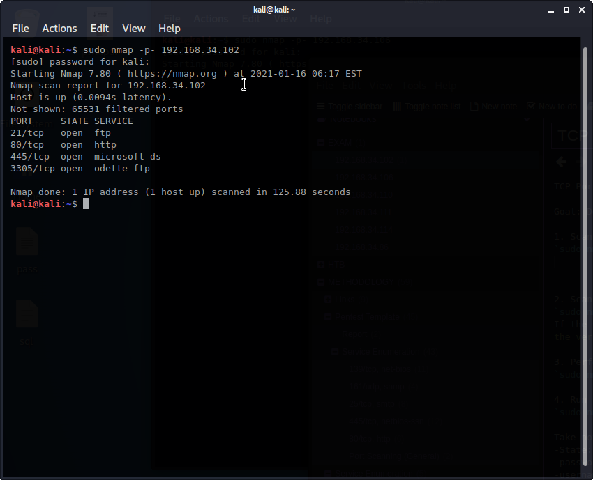

Open ports are 21, 80, 445, 3305

2. Scan the open ports for service detection.
`sudo nmap -p21,80,445,3305 -sV 192.168.34.102`
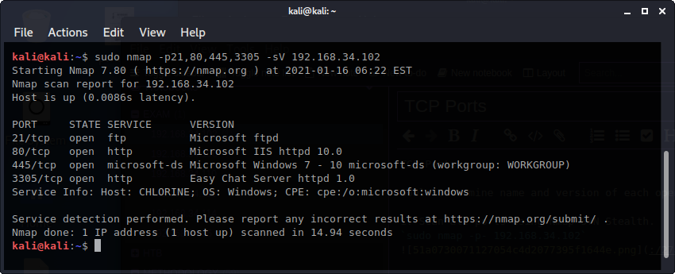

Still need version number for ports 21, 445. 
We have a hostname CHLORINE, likely a Windows machine

3. Perform aggressive scan.
`sudo nmap -p21,80,445,3305 -A 192.168.34.102`
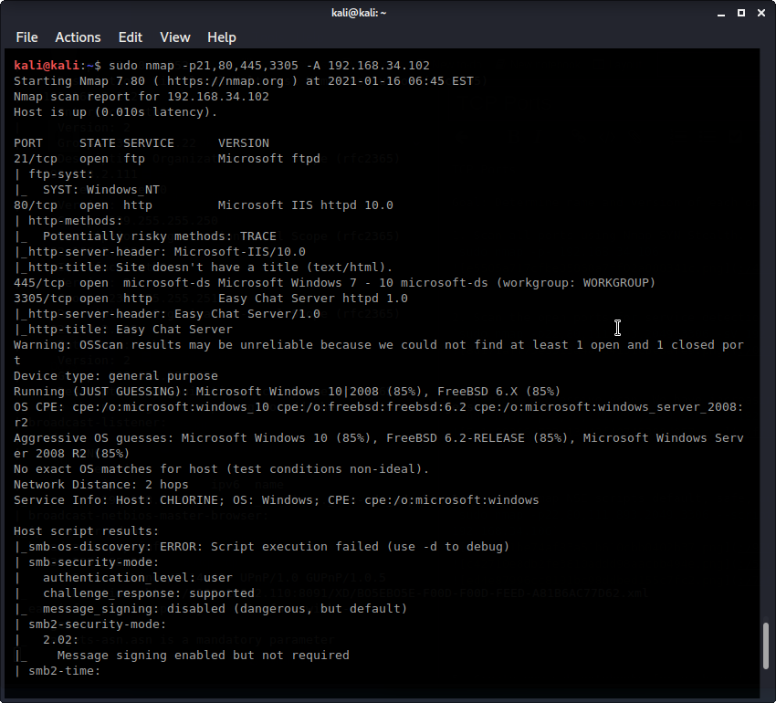
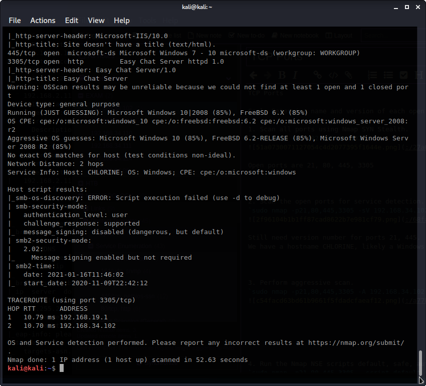

4. Run the Nmap NSE scripts default, safe, auth, vuln on the open ports.
`sudo nmap -p21,80,445,3305 --script default,safe,auth,vuln 192.168.34.102`
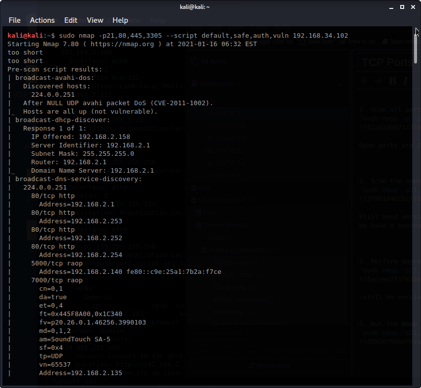
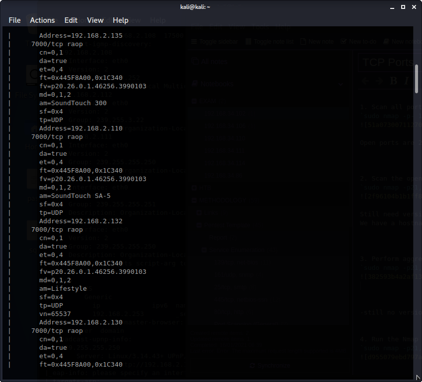
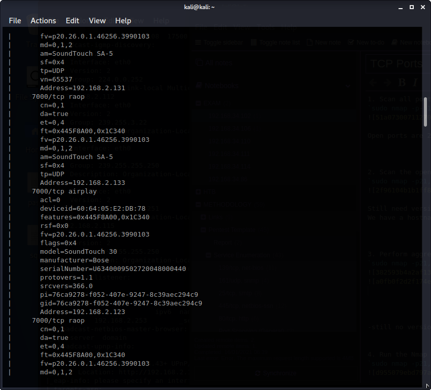
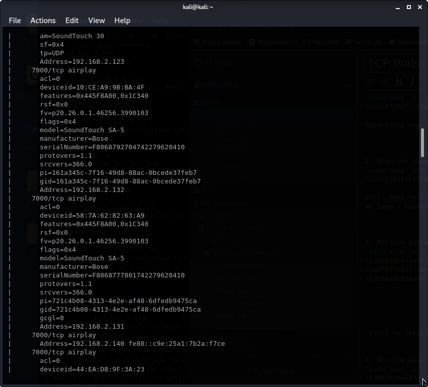
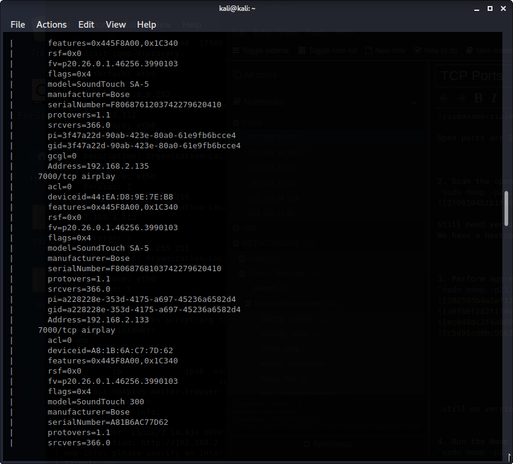
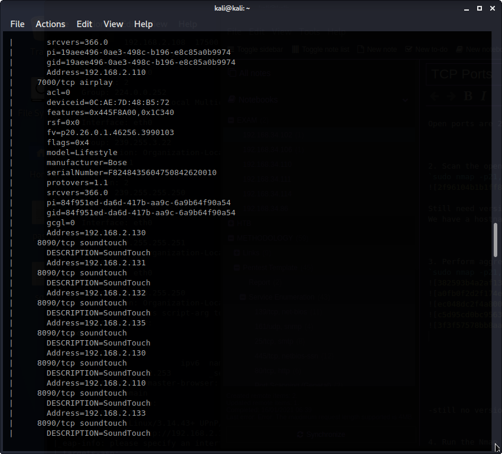
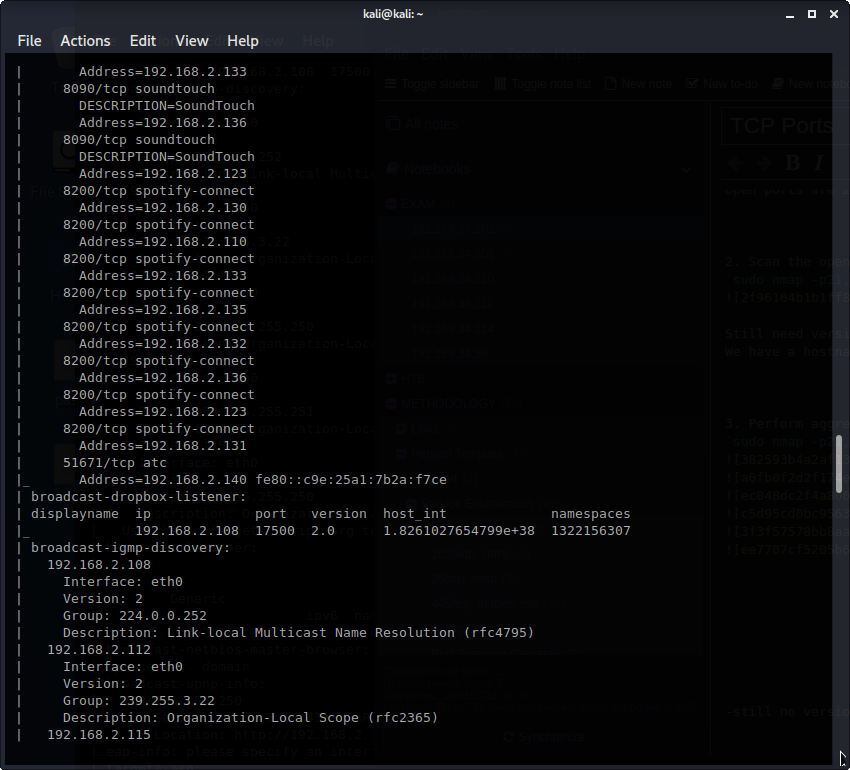
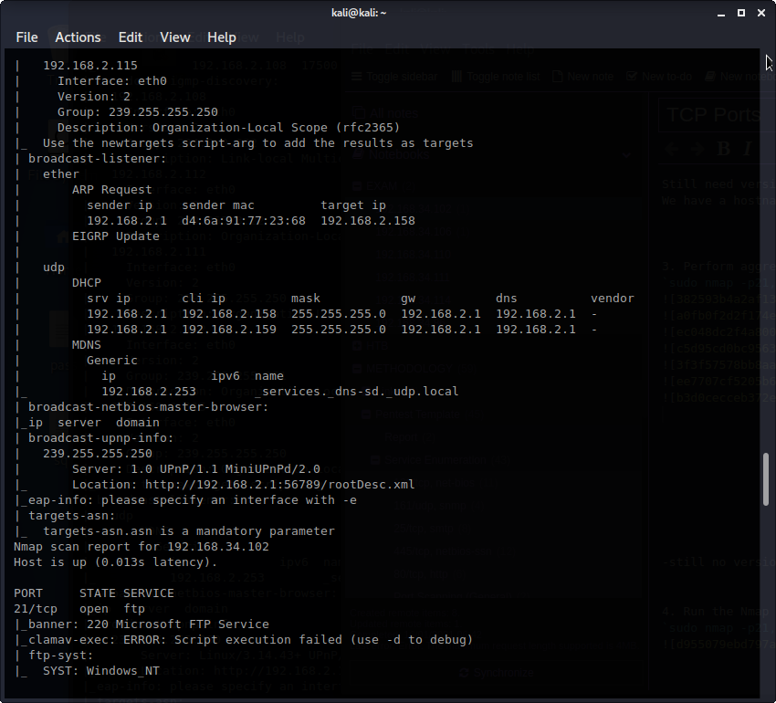
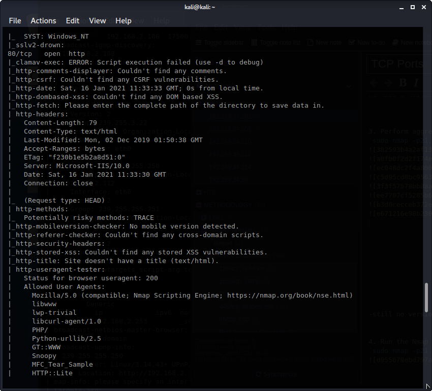
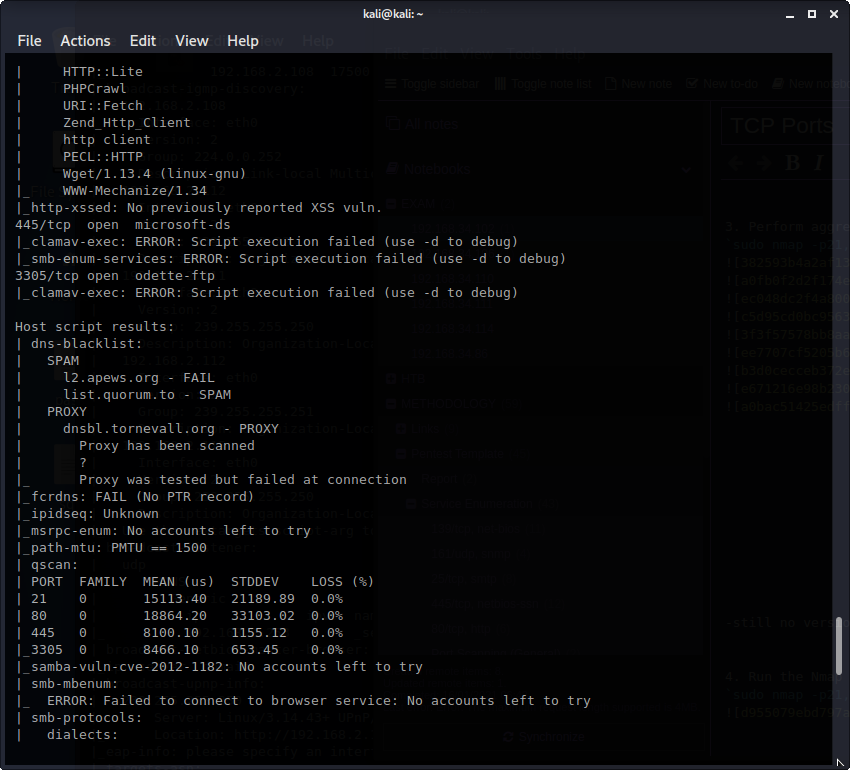
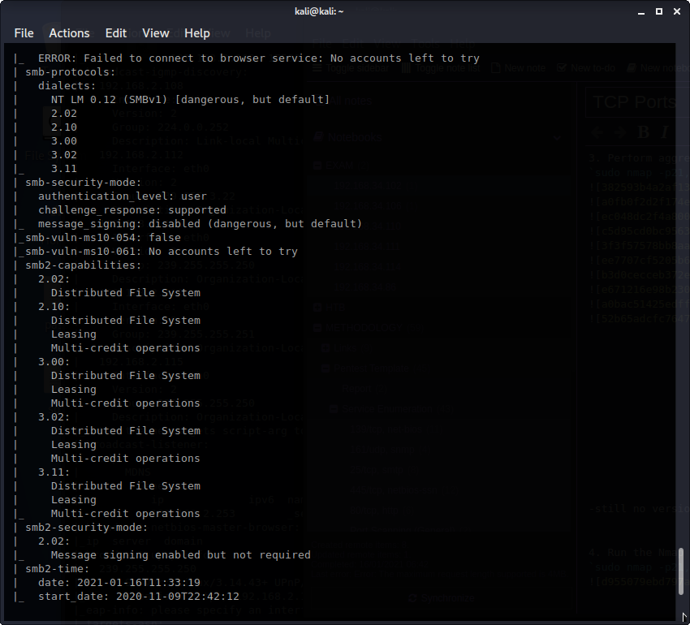
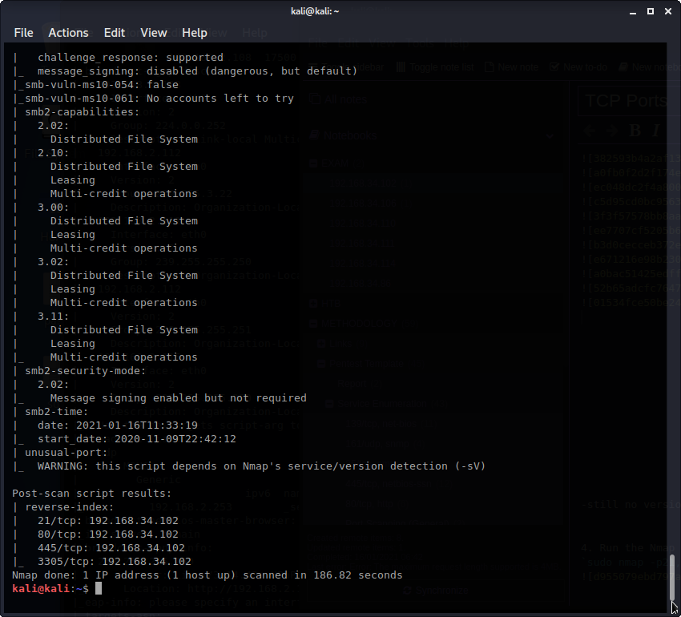

5. Create new sub-notebooks for each port/service name