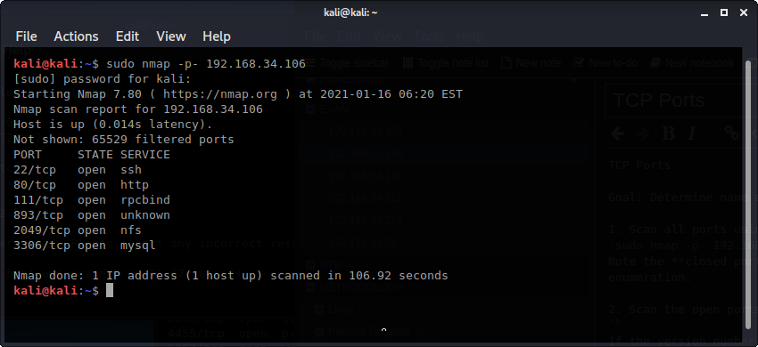
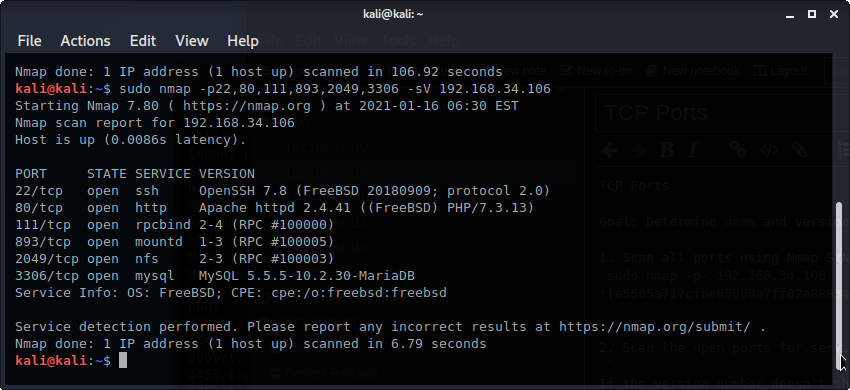
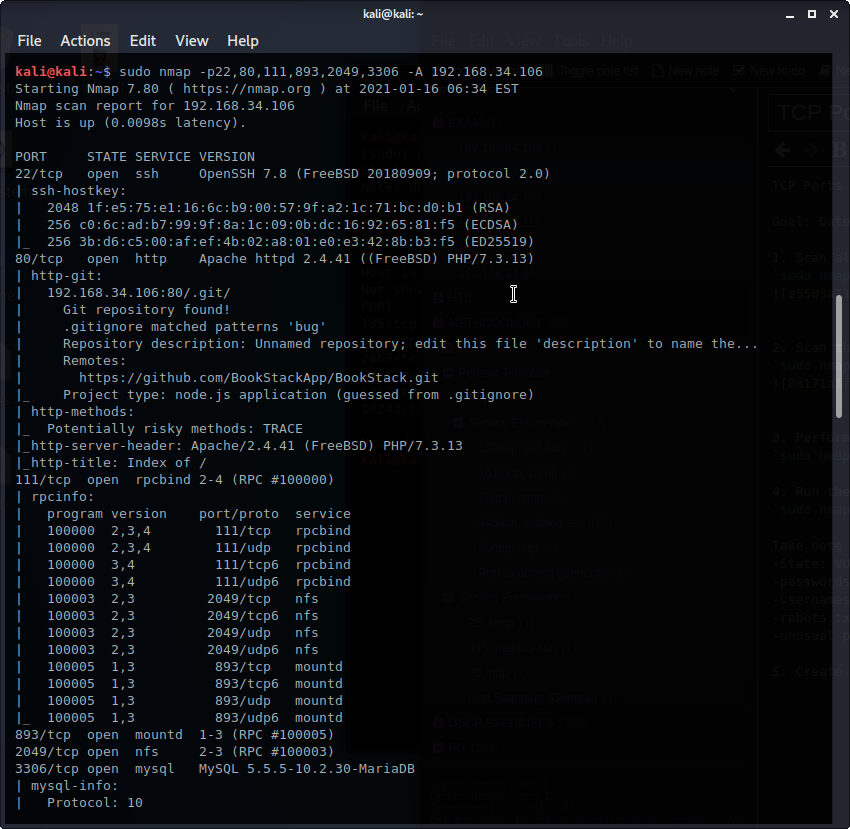
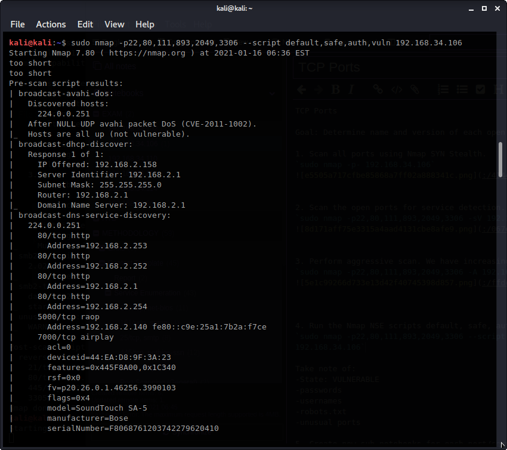
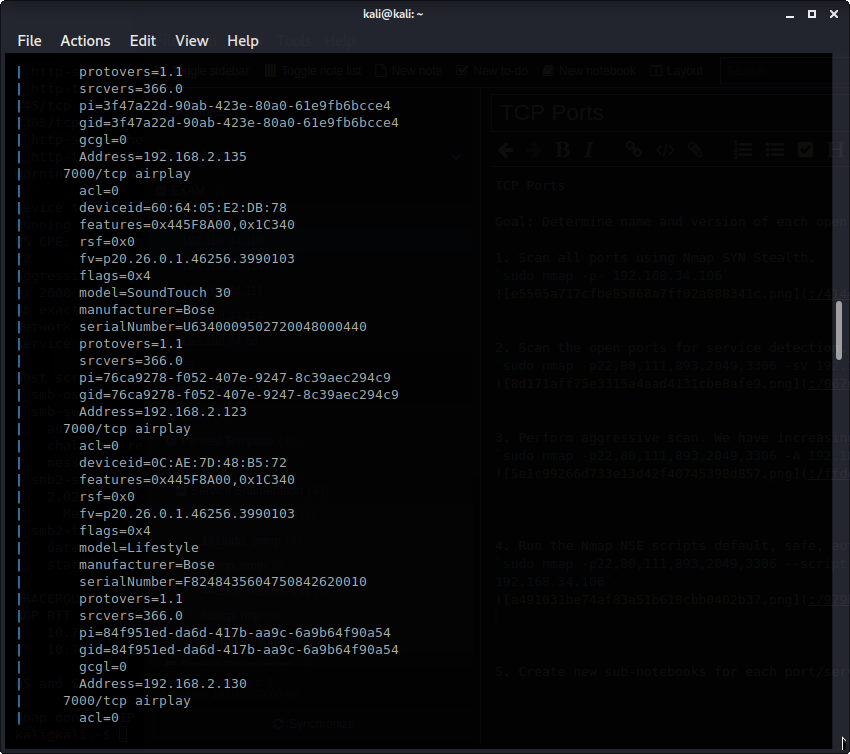
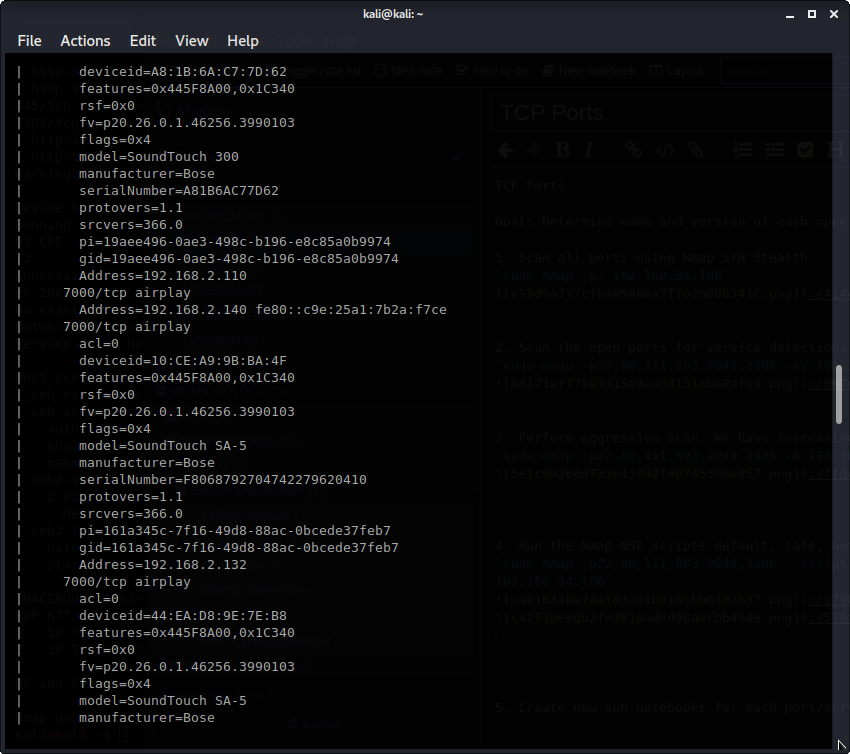

TCP Ports

TCP Ports

Goal: Determine name and version of each open port

1. Scan all ports using Nmap SYN Stealth.
`sudo nmap -p- 192.168.34.106`

2. Scan the open ports for service detection.
`sudo nmap -p22,80,111,893,2049,3306 -sV 192.168.34.106`

3. Perform aggressive scan. We have increasingly more data.
`sudo nmap -p22,80,111,893,2049,3306 -A 192.168.34.106`

4. Run the Nmap NSE scripts default, safe, auth, vuln on the open ports.
`sudo nmap -p22,80,111,893,2049,3306 --script default,safe,auth,vuln 192.168.34.106`

5. Create new sub-notebooks for each port/service name