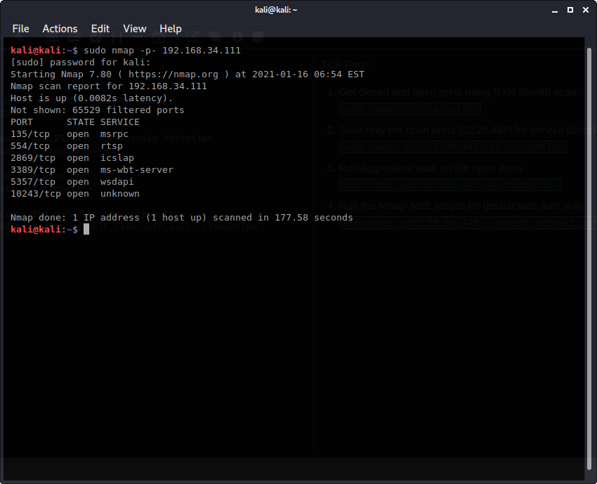
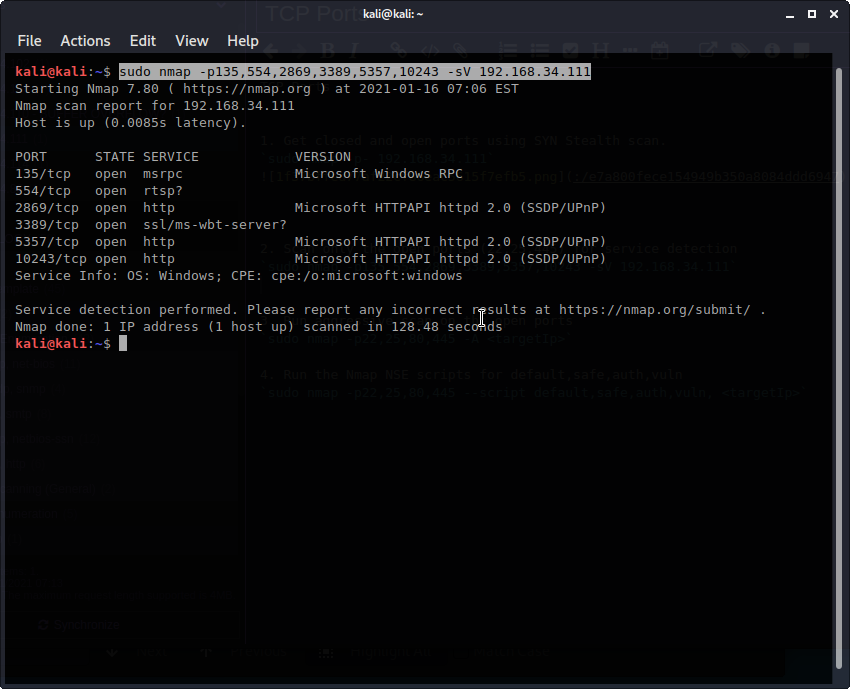
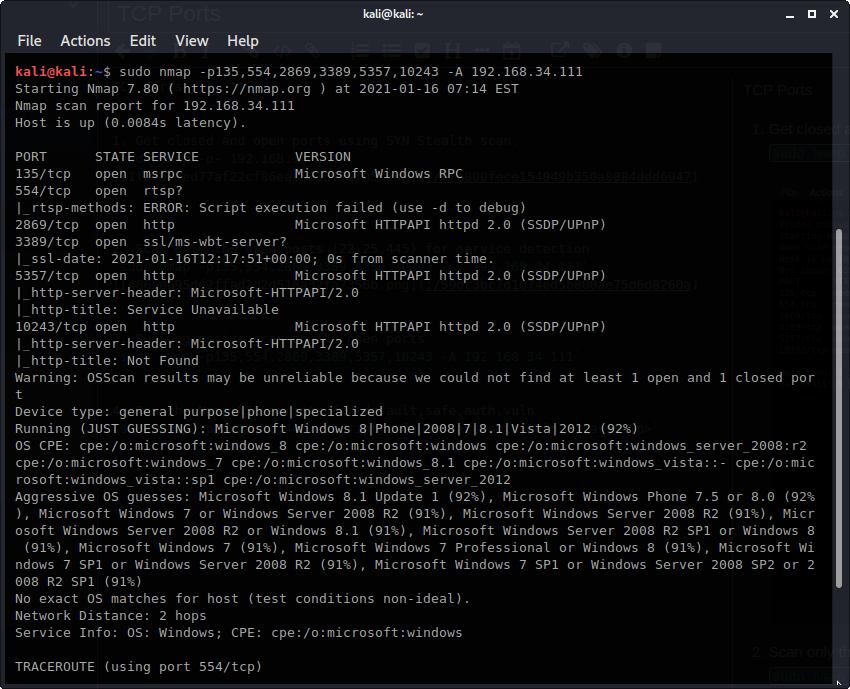
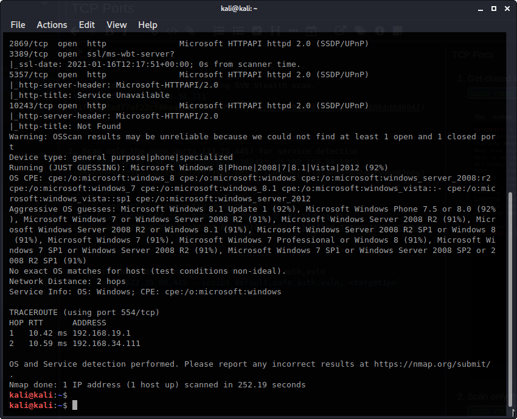
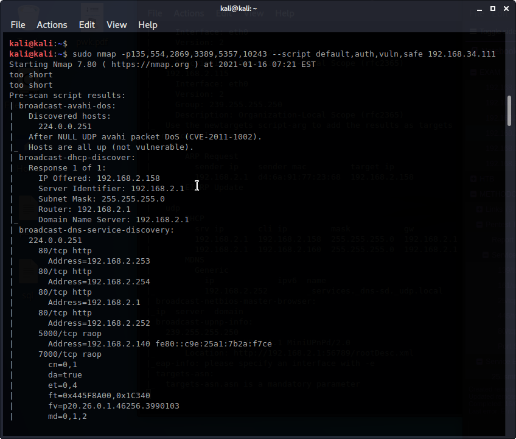
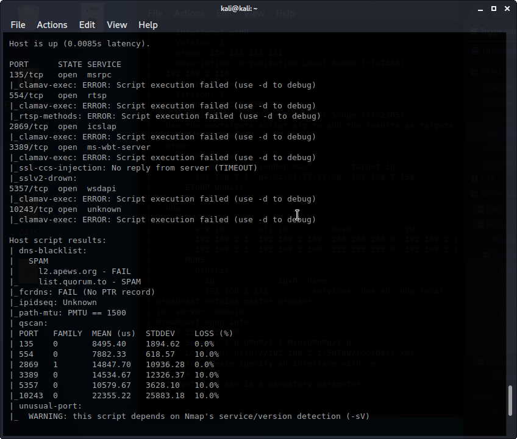

TCP Ports

TCP Ports

1. Get closed and open ports using SYN Stealth scan. 
`sudo nmap -p- 192.168.34.111`

2. Scan only the open ports (22,25,445) for service detection
`sudo nmap -p135,554,2869,3389,5357,10243 -sV 192.168.34.111`

3. Run aggressive scan on the open ports
`sudo nmap -p135,554,2869,3389,5357,10243 -A 192.168.34.111`

4. Run the Nmap NSE scripts for default,safe,auth,vuln
`sudo nmap -p135,554,2869,3389,5357,10243 --script default,auth,vuln,safe 192.168.34.111`

