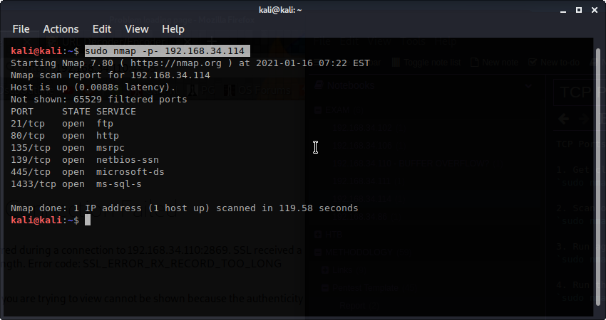
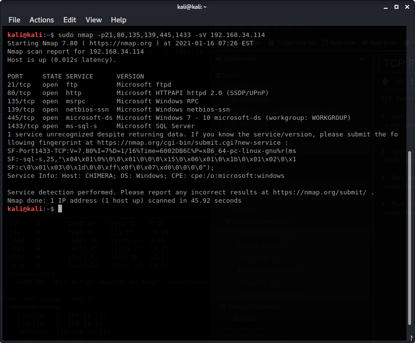
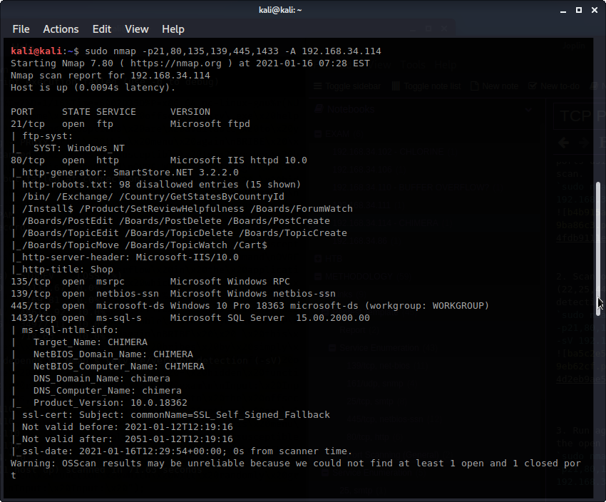
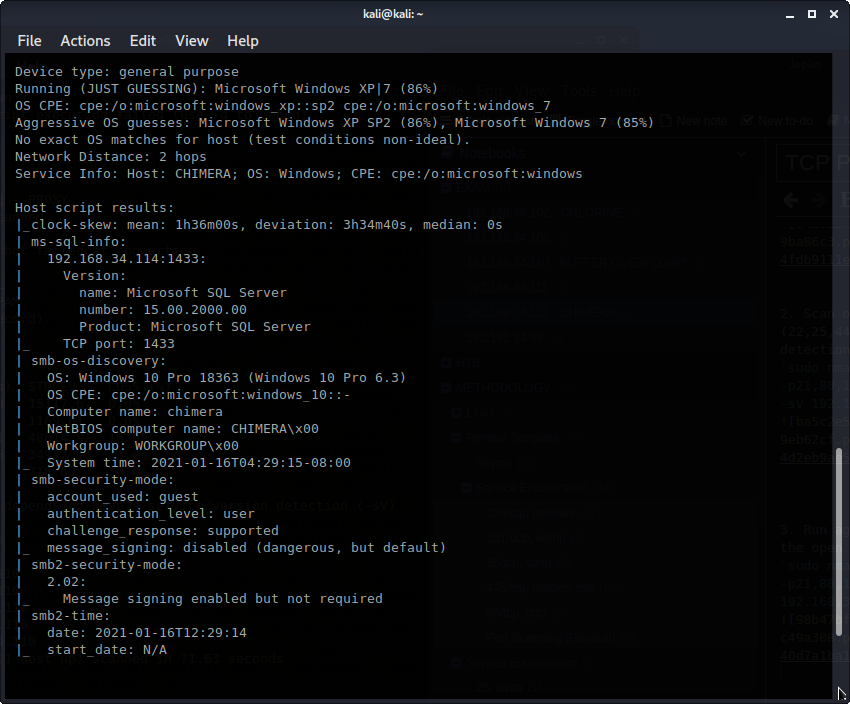
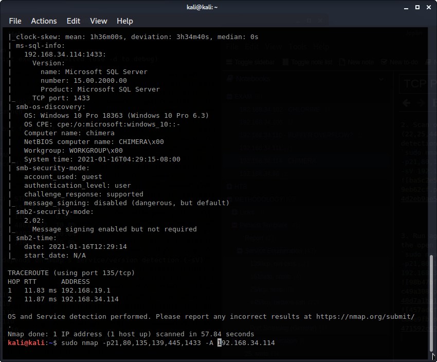

TCP Ports

TCP Ports

1. Get closed and open ports using SYN Stealth scan. 
`sudo nmap -p- 192.168.34.114`

2. Scan only the open ports (22,25,445) for service detection
`sudo nmap -p21,80,135,139,445,1433 -sV 192.168.34.114`

3. Run aggressive scan on the open ports
`sudo nmap -p21,80,135,139,445,1433 -A 192.168.34.114`

4. Run the Nmap NSE scripts for default,safe,auth,vuln
`sudo nmap  --script default,safe,auth,vuln, <targetIp>`