TCP Ports

TCP Ports

1. Get closed and open ports using SYN Stealth scan. 
`sudo nmap -p- 192.168.34.86`
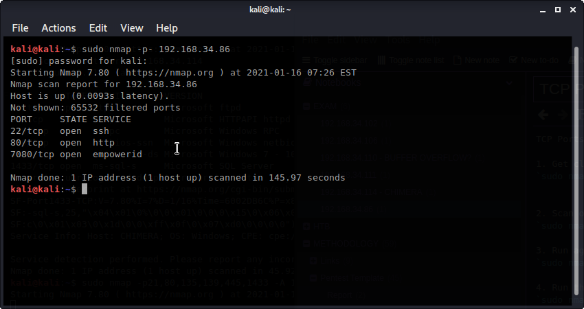

2. Scan only the open ports for service detection
`sudo nmap -p22,80,7080 -sV 192.168.34.86`
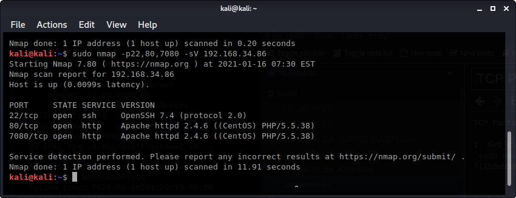

3. Run aggressive scan on the open ports
`sudo nmap -p22,80,7080 -A 192.168.34.86`
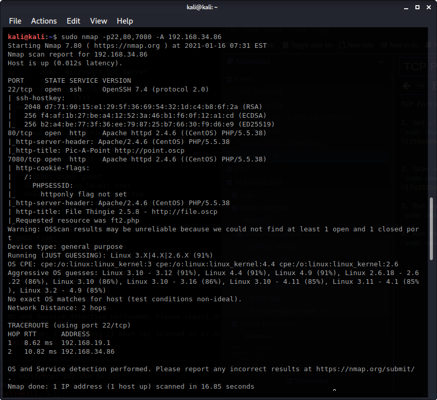

4. Run the Nmap NSE scripts for default,safe,auth,vuln
`sudo nmap -p22,80,7080 --script safe,auth,vuln,default 192.168.34.86`
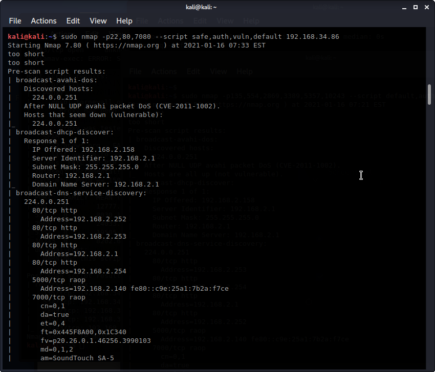
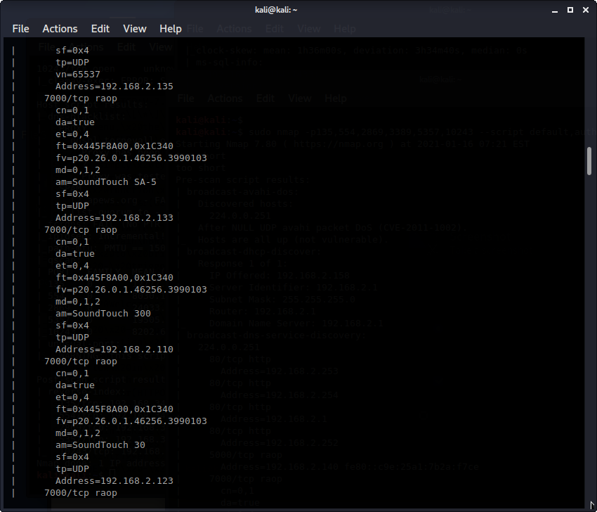
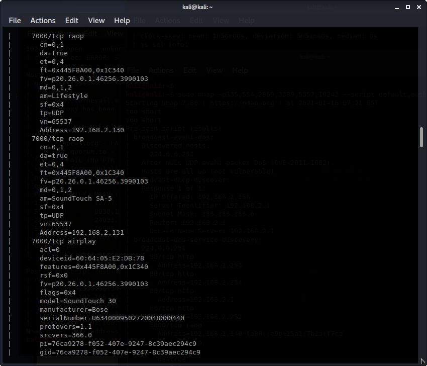
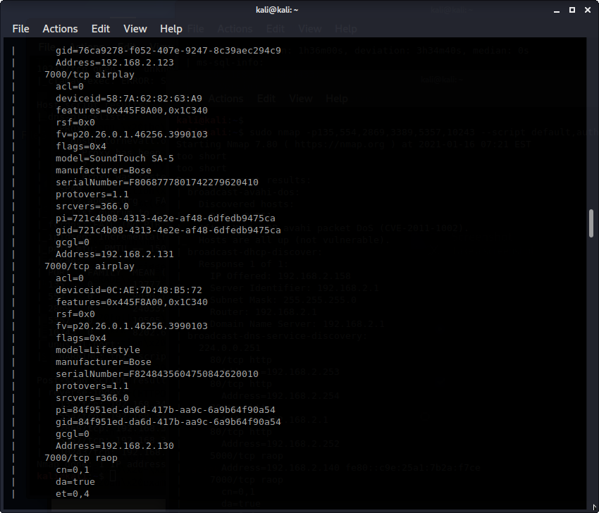
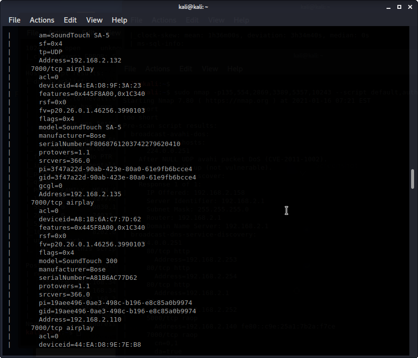
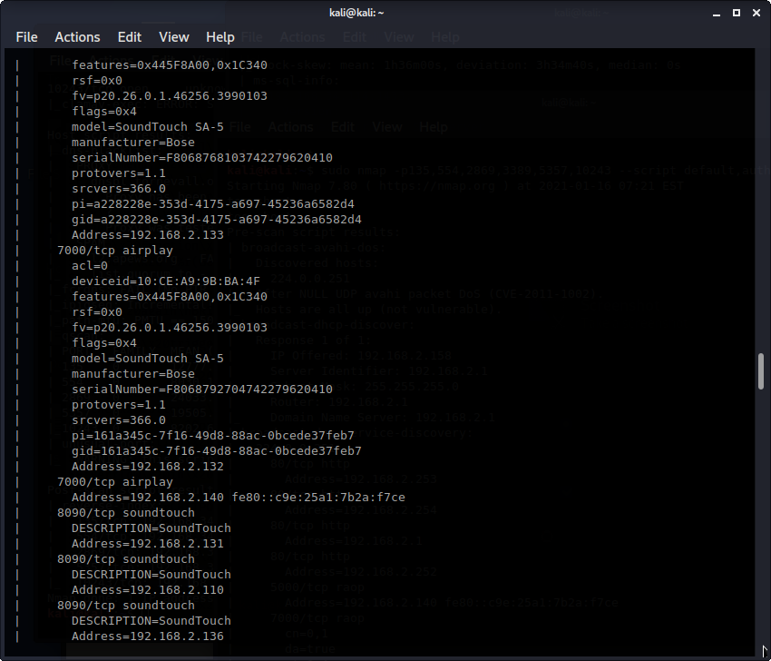

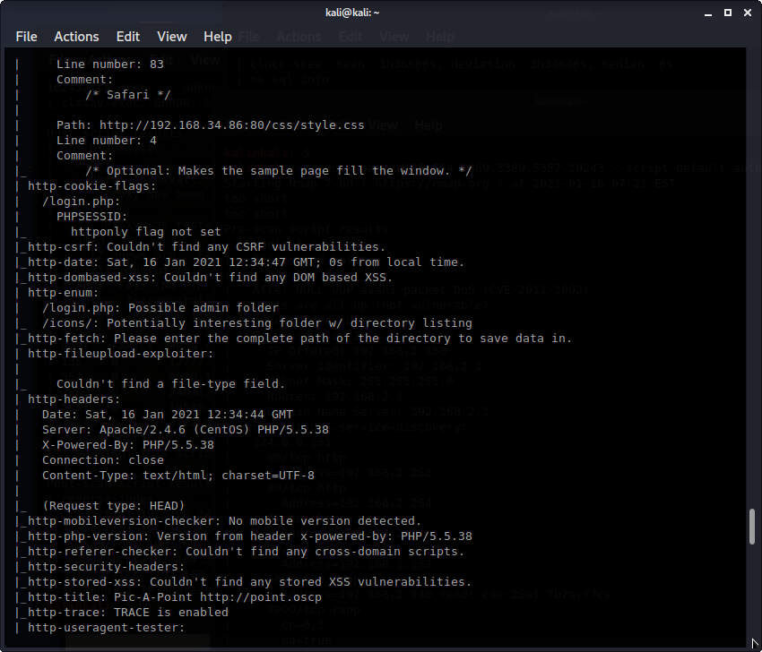
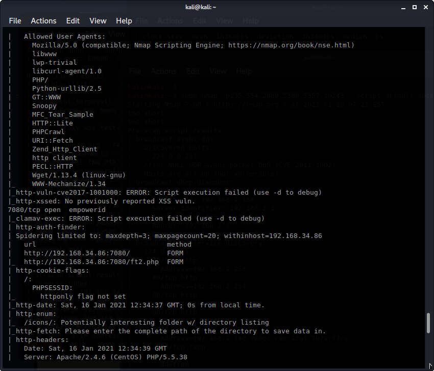
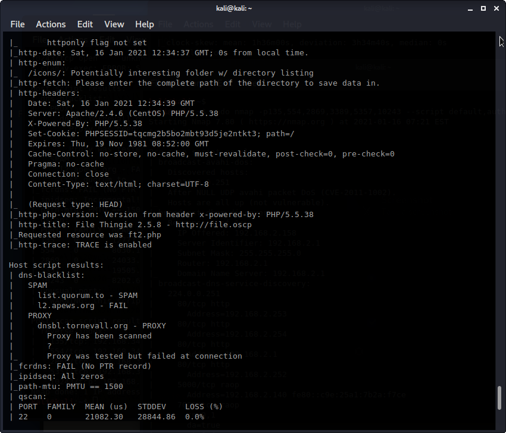
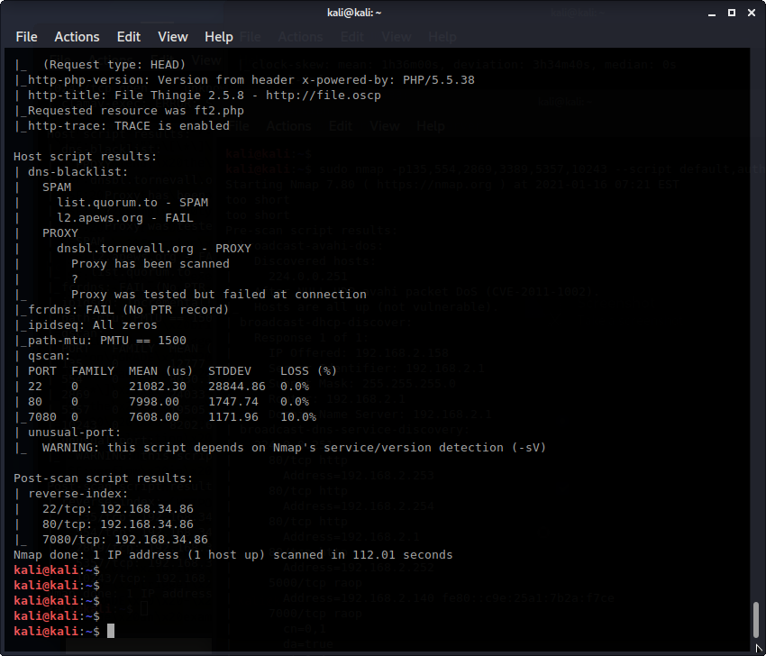

