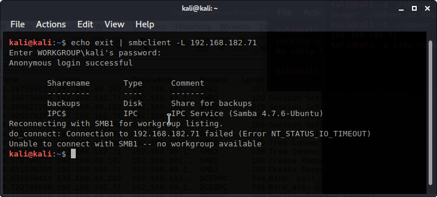
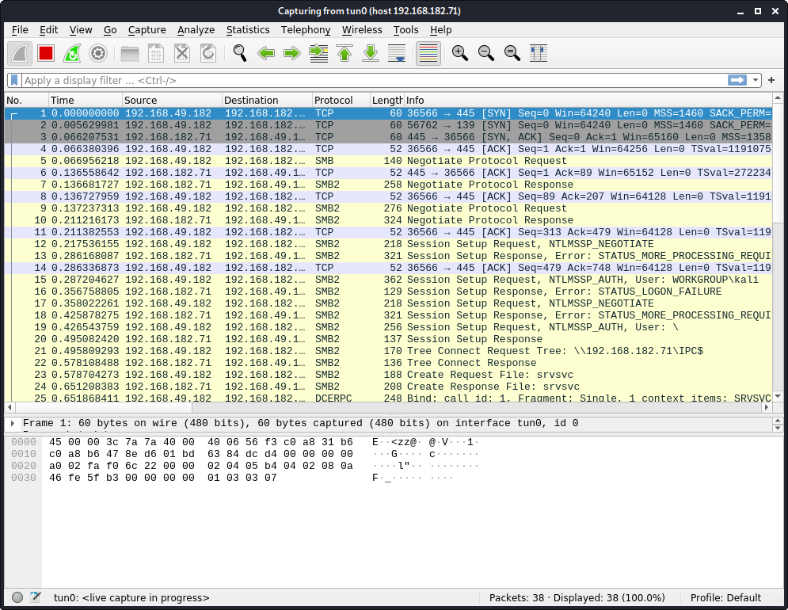
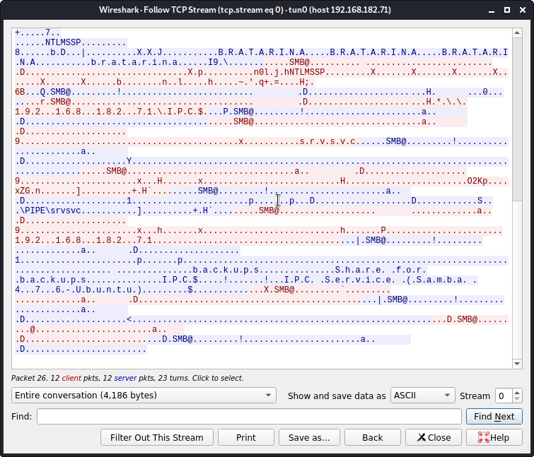

Wireshark

Wireshark

# Wireshark
Start wireshark for the target. In this example, the capture filter is tun0 -> host 192.168.182.71

Run smbclient
`echo exit | smbclient -L 192.168.182.71`

View Wireshark output

Follow the TCP stream on the SYN ACK packet. You may have to scroll down a bit, but the version shows

