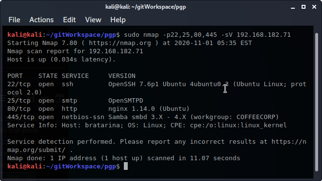
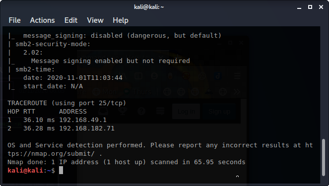
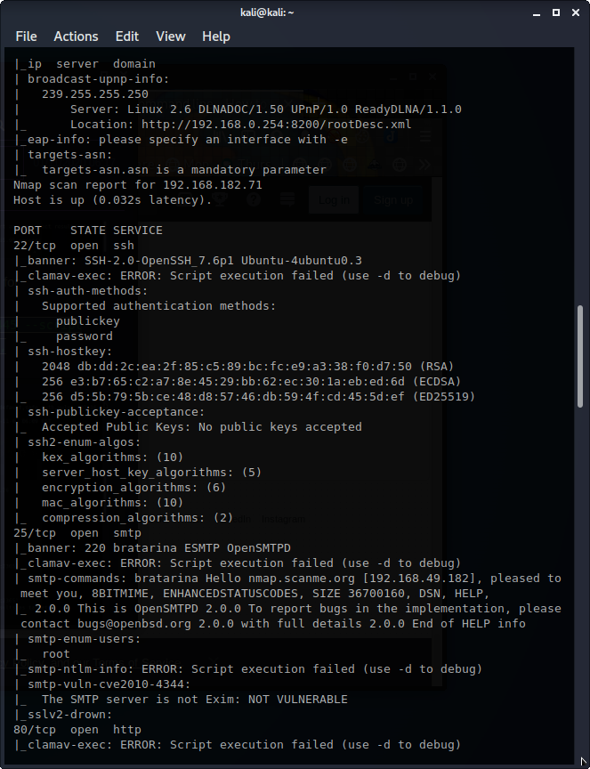
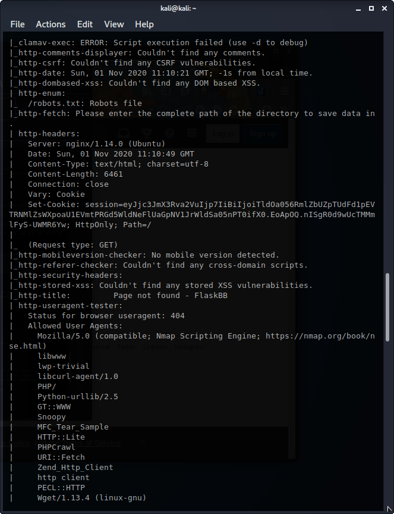
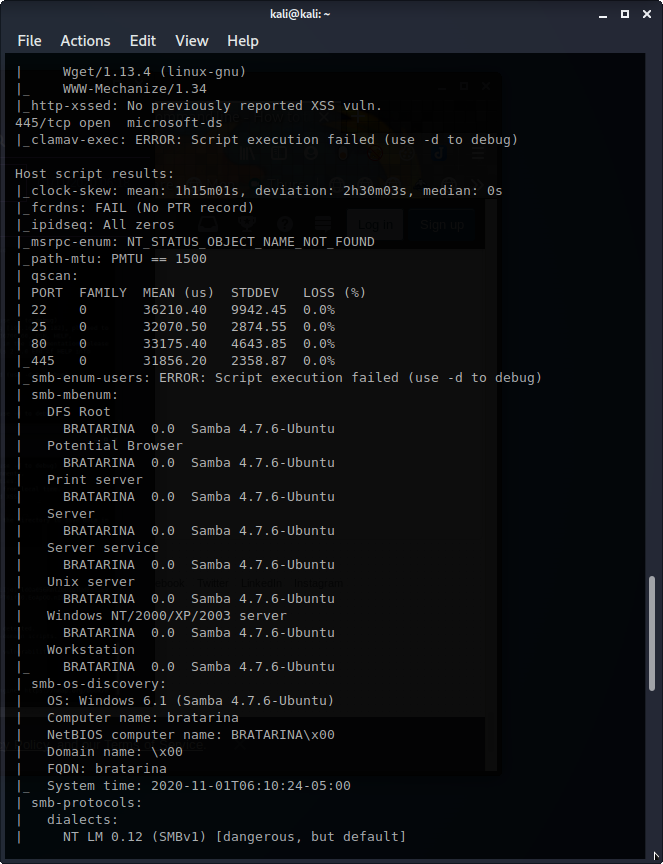
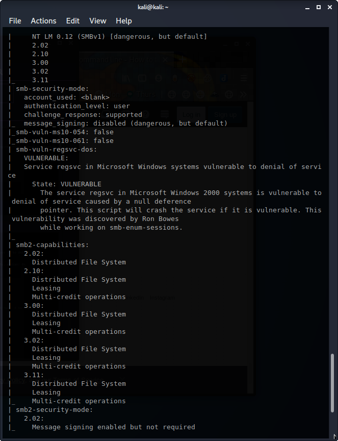
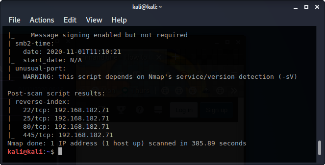

TCP Ports

TCP Ports

1. Get closed and open ports using SYN Stealth scan. 
`sudo nmap -p- 192.168.182.71`

We find open ports 22,25,445. Port 53 is closed

2. Scan only the open ports (22,25,445) for service detection
`sudo nmap -p22,25,80,445 -sV 192.168.182.71`

We find that port 25 OpenSMTPD is missing the version number still. Port 445 only has a range of version number 3.x - 4.x

3. Run aggressive scan on the open ports
`sudo nmap -p22,25,80,445 -A 192.168.182.71`

We see versions:
-OpenSMPTD 2.0.0
-Samba smbd 4.7.6-Ubuntu

4. Run the Nmap NSE scripts for default,safe,auth,vuln
`sudo nmap -p22,25,80,445 --script default,safe,auth,vuln, 192.168.182.71`

Observe:
-port 25, username root
-port 80, there is a session cookie value session=eyJjc3JmX3Rva2VuIjp7IiBiIjoiTldOa056RmlZbUZpTUdFd1pEVTRNMlZsWXpoaU1EVmtPRGd5WldNeFlUaGpNV1JrWldSa05nPT0ifX0.EoApOQ.nISgR0d9wUcTMMm
-service regsvc is vulnerable to dos

