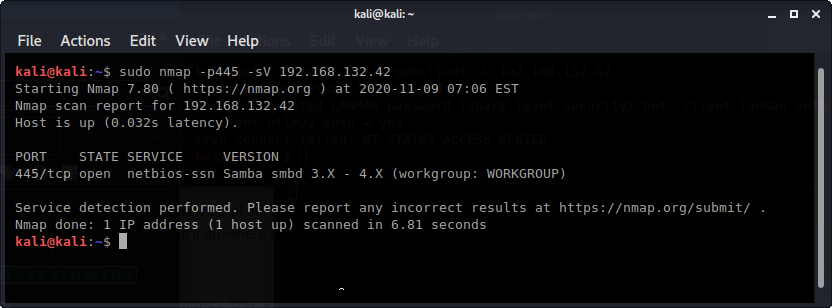
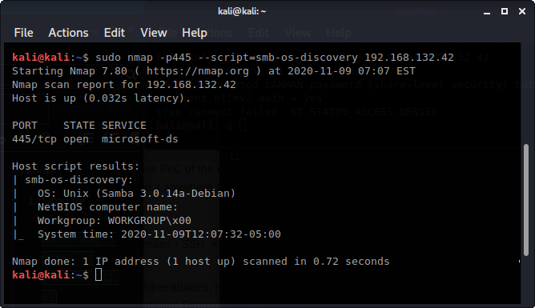
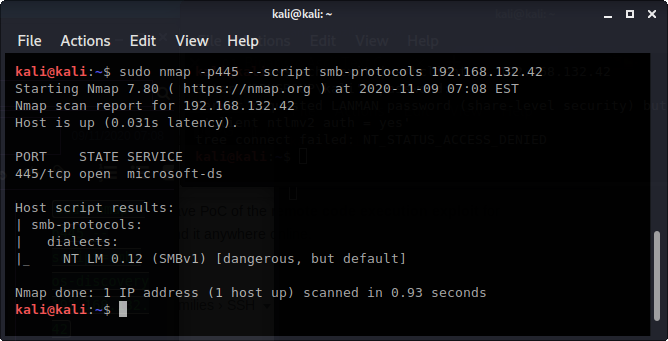
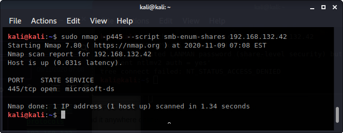
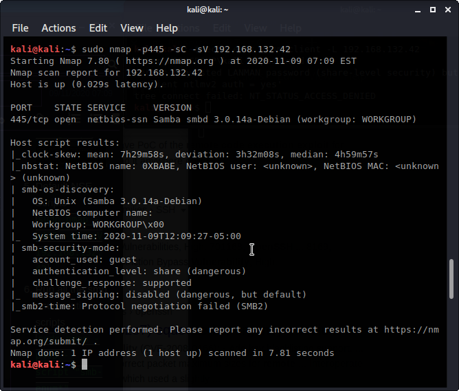
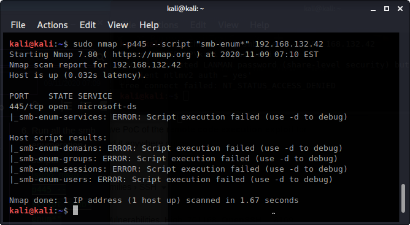
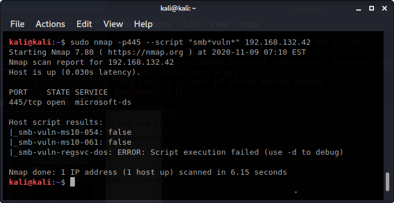

Nmap

Nmap

1. Scan for netbios
`sudo nmap -p445 -sV 192.168.132.42`

2. SMB OS discovery
`sudo nmap -p445 --script=smb-os-discovery 192.168.132.42`

3. SMB Protocol
`sudo nmap -p445 --script smb-protocols 192.168.132.42`

4. List shares
`sudo nmap --script smb-enum-shares -p445 <targetIp>`

5. Default NSE Scripts
`sudo nmap -p445 -sC -sV 192.168.132.42`

6. Run all the smb enumeration scripts
`sudo nmap -p445 --script "smb-enum*" 192.168.132.42`

7. Run all smb vulnerable scripts
`sudo nmap -p445 --script "smb*vuln*" 192.168.132.42`

