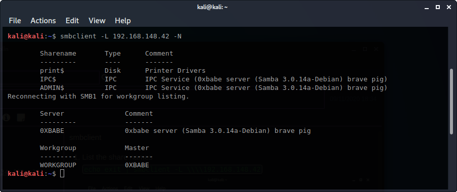
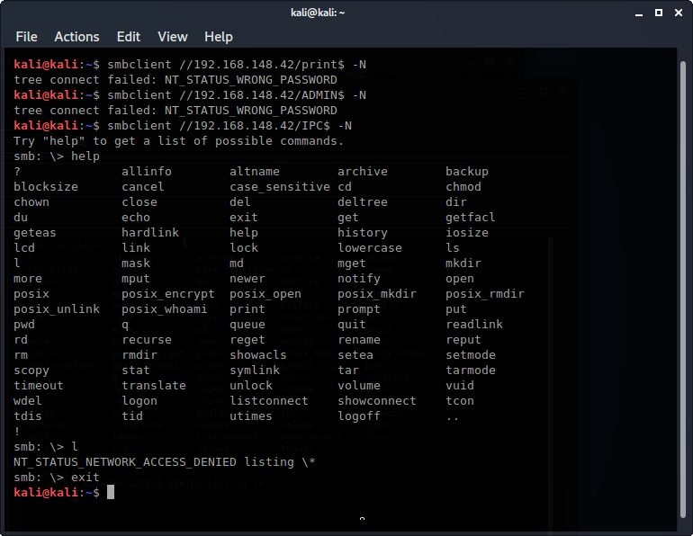

smbclient

smbclient

1. List the share names
`echo exit | smbclient -L \\\\192.168.148.42`


2. Another method to establish an anonymous login and find the share names
`smbclient -L 192.168.148.42 -N`


There are 3 shares: ```ADMIN$, IPC$, print$```


3. Connect to a share
`smbclient //192.168.148.42/print$ -N`
`smbclient //192.168.148.42/ADMIN$ -N`
`smbclient //192.168.148.42/IPC$ -N`
`help`	# To view commands
`l`		# List the directory contents
`exit`


We did not find any meaningful info.


