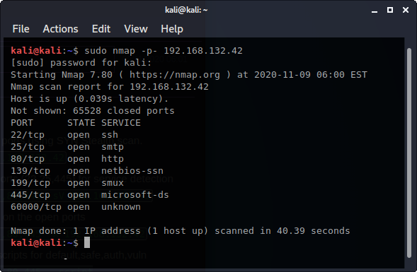
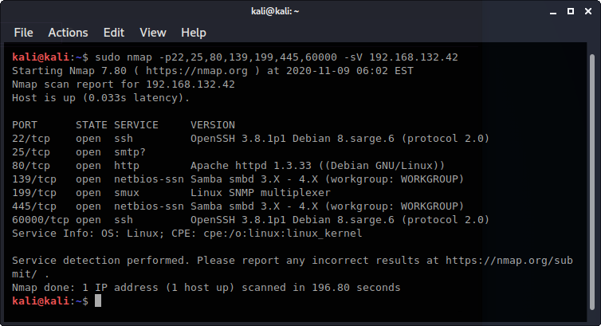
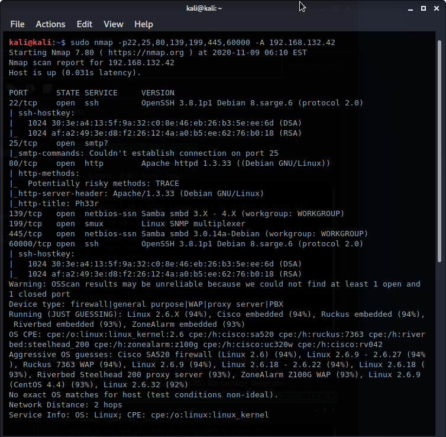
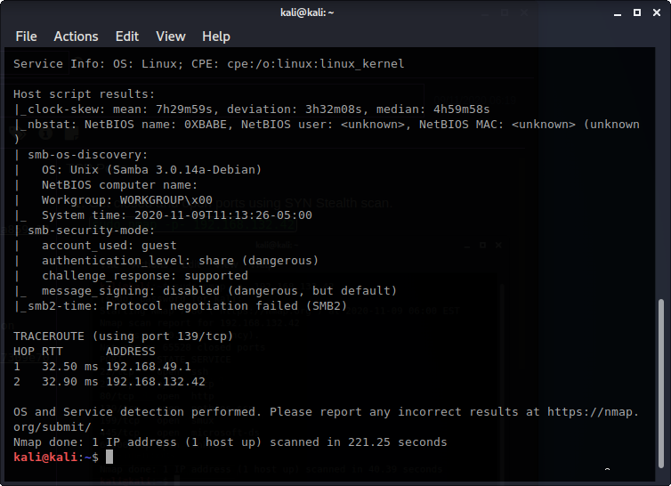
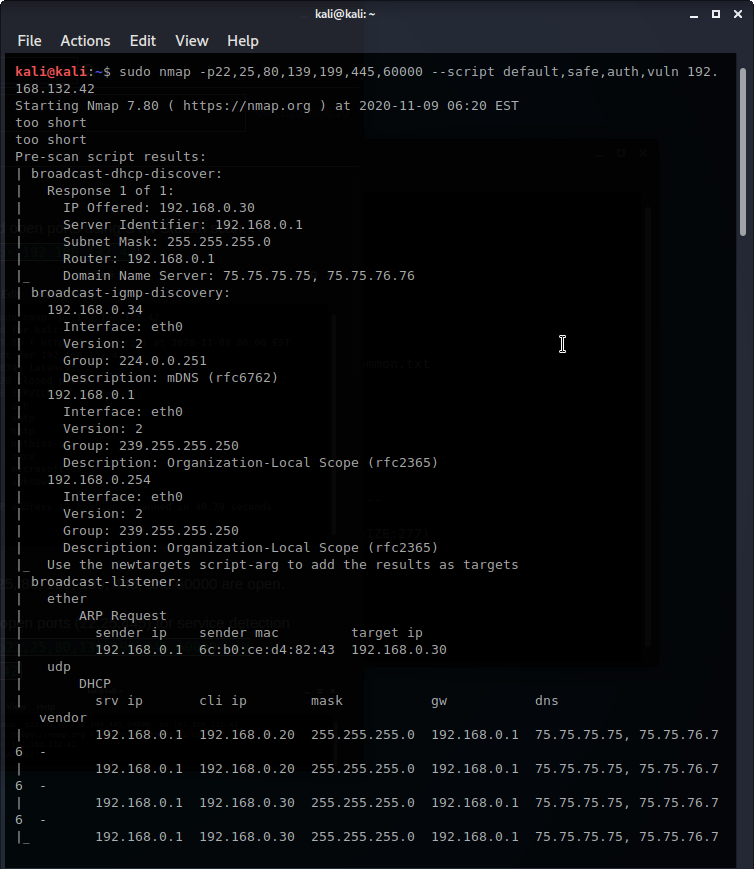
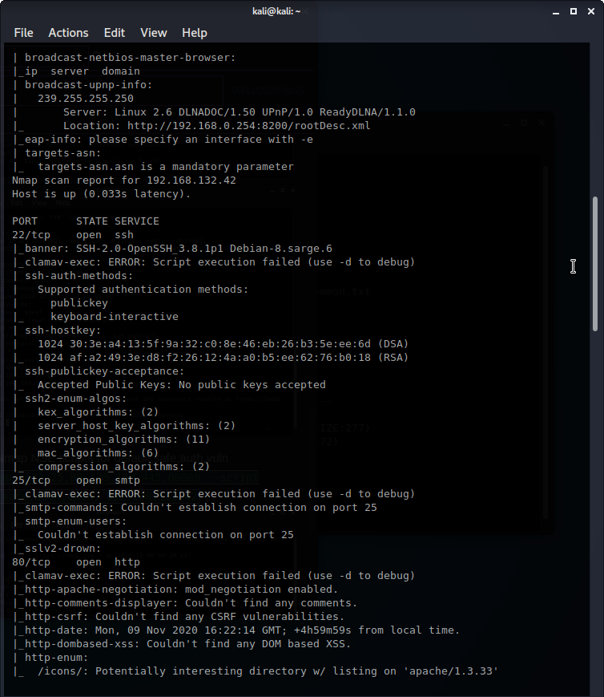
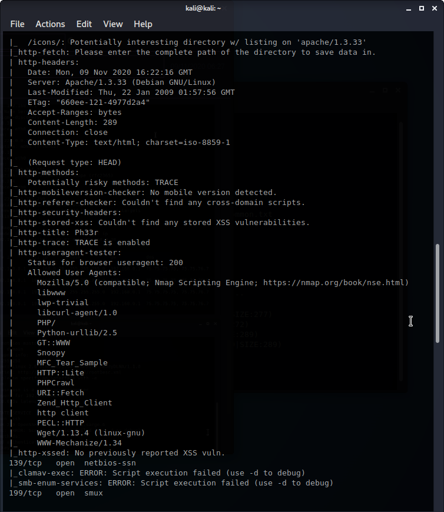
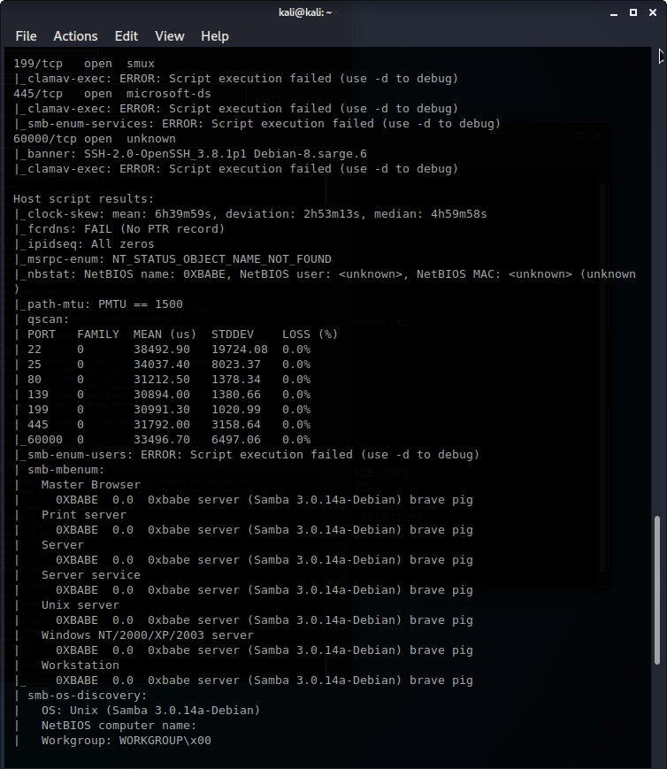
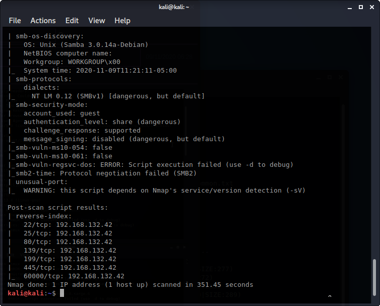

TCP Ports

TCP Ports

1. Get closed and open ports using SYN Stealth scan. 
`sudo nmap -p- 192.168.132.42`

We see ports 22, 25, 80, 139, 199, 445, and 60000 are open.

2. Scan only the open ports (22,25,445) for service detection
`sudo nmap -p22,25,80,139,199,445,60000 -sV 192.168.132.42`

We didn't get version for ports 25, 139, 199.
Likely to be a Linux machine.

3. Run aggressive scan on the open ports
`sudo nmap -p22,25,80,139,199,445,60000 -A 192.168.132.42`

4. Run the Nmap NSE scripts for default,safe,auth,vuln
`sudo nmap -p22,25,80,139,199,445,60000 --script default,safe,auth,vuln, 192.168.132.42`

- http-enum: has an interesting directory /icons/apache/1.3.33
- http-fetch: what is that
-smb-mbenum: Samba 3.0.14a-Debian

