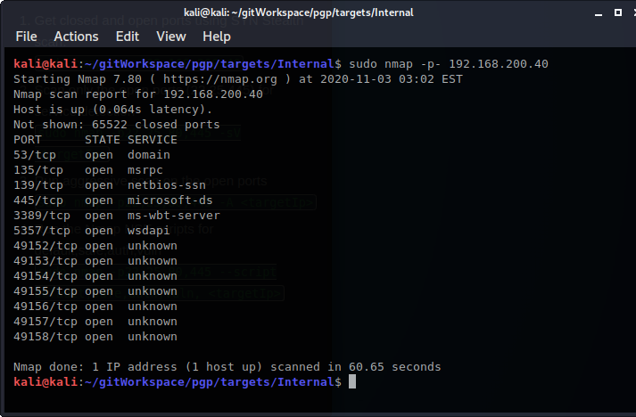
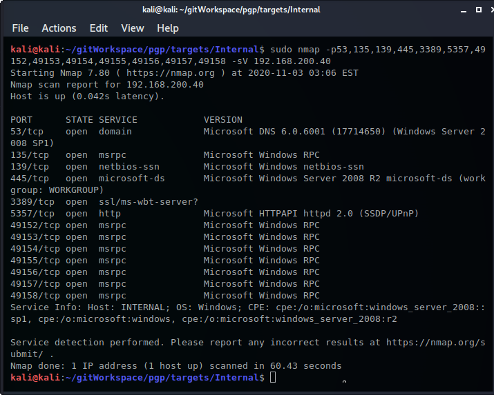
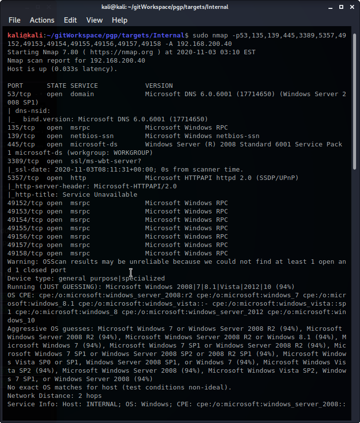
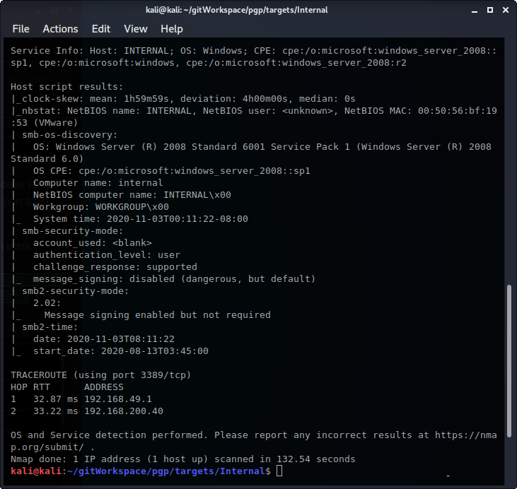
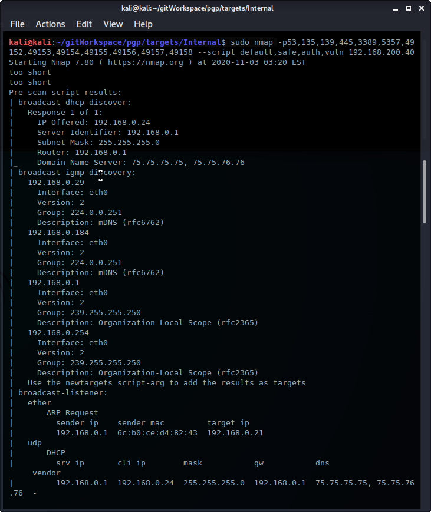
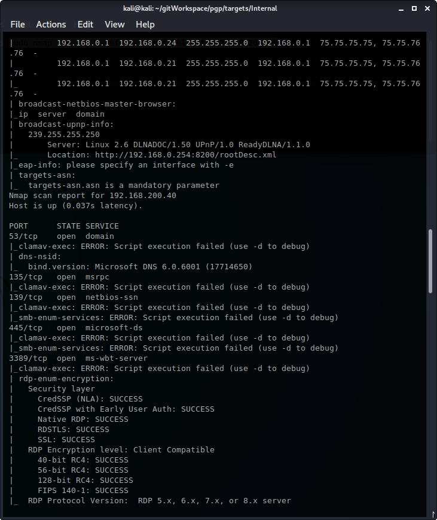
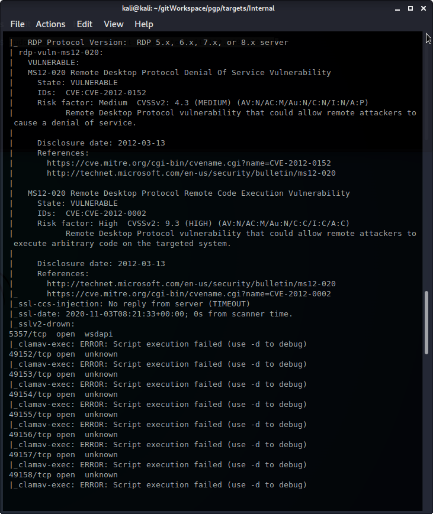
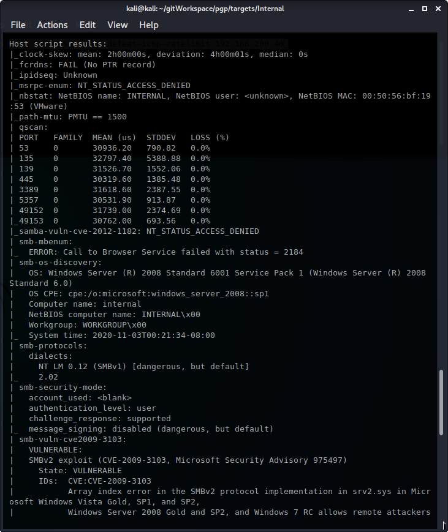
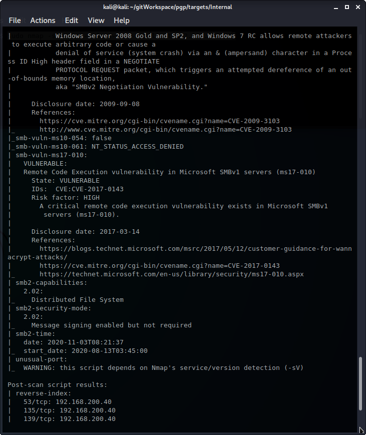
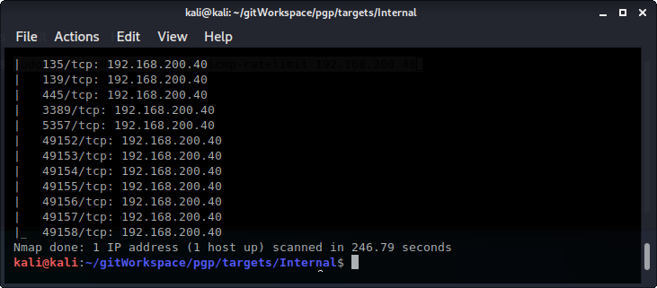

TCP Ports

TCP Ports

1. Get closed and open ports using SYN Stealth scan. 
`sudo nmap -p- 192.168.200.40`

-We see open ports 53,135,139,445,3389,5357,49152,49153,49154,49155,49156,49157,49158

2. Scan only the open ports for service detection
`sudo nmap -p53,135,139,445,3389,5357,49152,49153,49154,49155,49156,49157,49158 -sV 192.168.200.40`

-We see DNS version, alot of MS Windows RPC ports, port 445 has a workgroup, and port 3389 does not have any version. It is likely a Windows machine

3. Run aggressive scan on the open ports
`sudo nmap -p53,135,139,445,3389,5357,49152,49153,49154,49155,49156,49157,49158 -A 192.168.200.40`

-We have a Windows Server version: Windows Server  2008 Standard 6001 Service Pack 1

4. Run the Nmap NSE scripts for default,safe,auth,vuln
`sudo nmap -p53,135,139,445,3389,5357,49152,49153,49154,49155,49156,49157,49158 --script default,safe,auth,vuln 192.168.200.40`

-port 3389 vulnerable to MS12-020 RDP DOS
-port 3389 vulnerable to MS12-020 RDP Remote Code Execution CVE 2012-0002
-vuln to smbv2 exploit cve-2009-3103
-vulnerable to ms17-010

