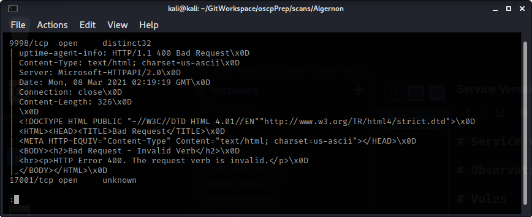
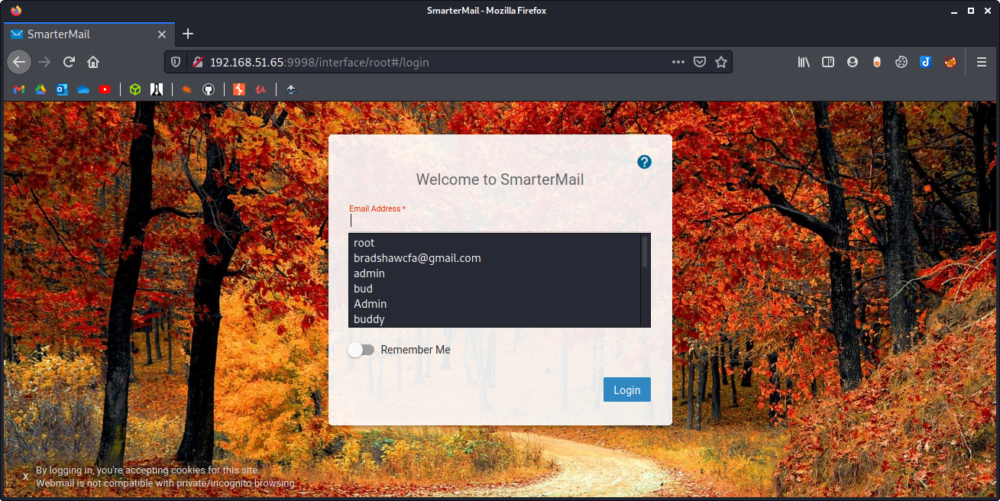
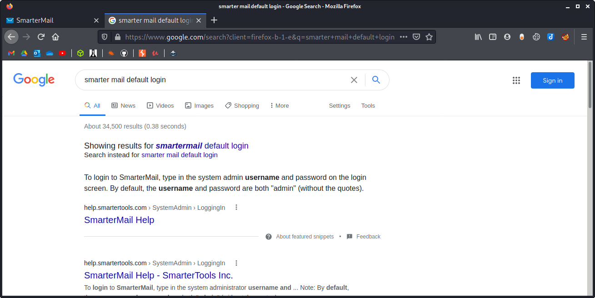
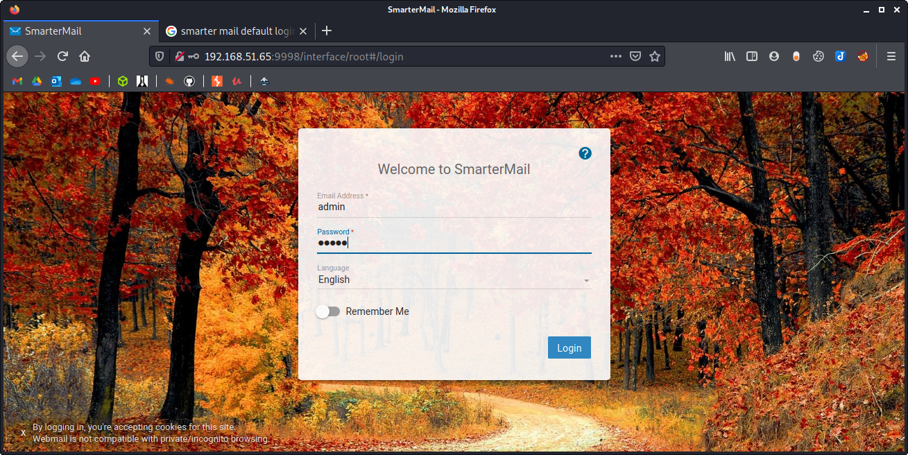
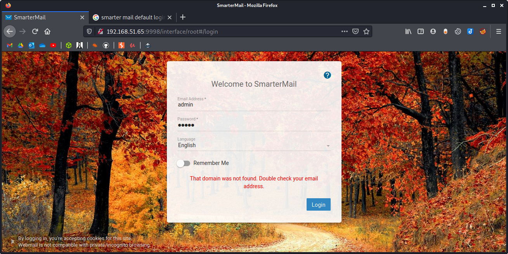
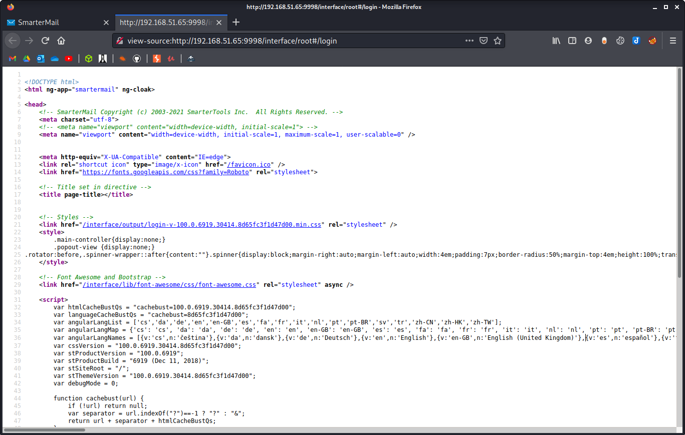
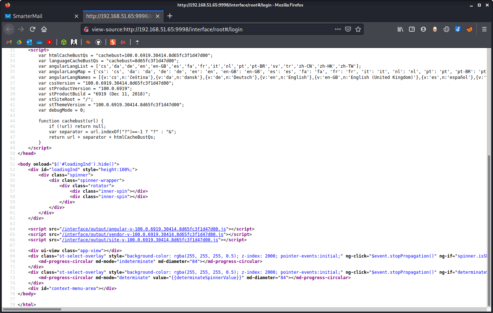

Service Version

# Service Version
-nmap headers: 
	Server: **Microsoft-HTTPAPI/2.0\x0D**
	http-server-header: **Microsoft-IIS/10.0**


# Observations
-
-why is \0D tacked onto the end of these headers when requesting resouce /interface/root (which also had a different header **Microsoft-HTTPAPI/2.0\x0D**)... might be URL encoded
```plaintext
9998/tcp  open     distinct32
| uptime-agent-info: HTTP/1.1 400 Bad Request\x0D
| Content-Type: text/html; charset=us-ascii\x0D
| Server: Microsoft-HTTPAPI/2.0\x0D
| Date: Mon, 08 Mar 2021 02:19:19 GMT\x0D
| Connection: close\x0D
| Content-Length: 326\x0D
| \x0D
| <!DOCTYPE HTML PUBLIC "-//W3C//DTD HTML 4.01//EN""http://www.w3.org/TR/html4/strict.dtd">\x0D
| <HTML><HEAD><TITLE>Bad Request</TITLE>\x0D
| <META HTTP-EQUIV="Content-Type" Content="text/html; charset=us-ascii"></HEAD>\x0D
| <BODY><h2>Bad Request - Invalid Verb</h2>\x0D
| <hr><p>HTTP Error 400. The request verb is invalid.</p>\x0D
|_</BODY></HTML>\x0D
```

# Browser
-directed to /interface/root#/login: **SmarterMail**


### Default login
- [ ] Product version?
- [ ] how to log in without using email?
Smartermail is **admin:admin**

Although it asks for email, we try inputting admin:admin

Result


# Source



# Vulns